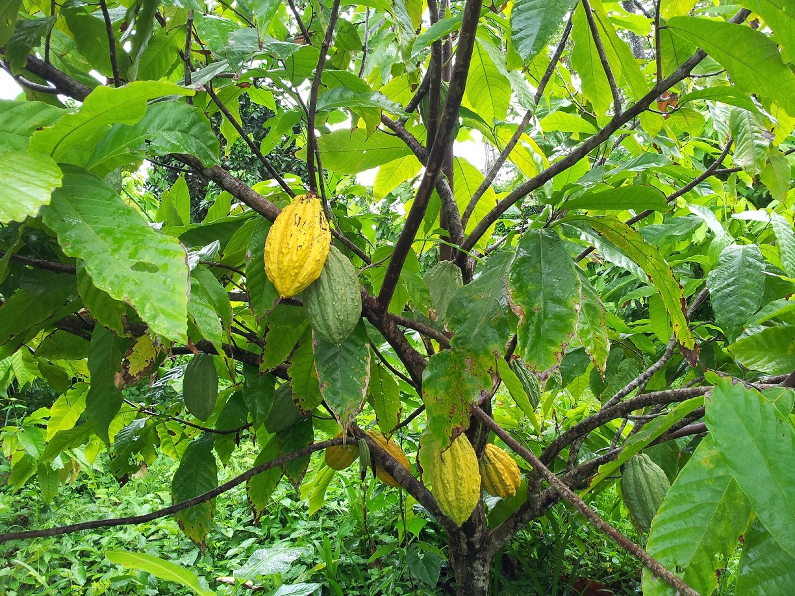

name: intro

<!-- F1D763 -->
<!-- F7A913 -->
<!-- C94326 -->
<!-- 1F908E -->
<!-- 33658A -->


```{r setup, include = FALSE,  eval = TRUE}
library('RefManageR')
source("../courses_tools/resources/knitr_setup.R")
main_dir <-  ''
common_img_dir <- file.path(main_dir,'courses_tools','resources', 'common_figs')
course_img_dir <- file.path(main_dir,'resources', 'figs')
BibOptions(check.entries = FALSE,
           bib.style = "authoryear",
           cite.style = "authoryear",
           style = "markdown",
           hyperlink = TRUE,
           max.names = 3,
           longnamesfirst= FALSE, 
           dashed = TRUE)
#myBib <- ReadBib('biblio_soutenance.bib', check = FALSE)
```

```{r xaringan-fit-screen, echo=FALSE}
xaringanExtra::use_fit_screen()
```


```{r datapackage, eval = TRUE, echo = FALSE, warning = FALSE}
ggplot <- function(...) ggplot2::ggplot(...) + scale_fill_manual(values = wesanderson::wes_palette(name = "Darjeeling1")) + scale_color_manual(values = wesanderson::wes_palette(name = "Darjeeling1")) +  scale_fill_manual(values = wesanderson::wes_palette(name = "Darjeeling1")) + theme_minimal()
#remotes::install_github('MarieEtienne/coursesdata', force = TRUE)
library(palmerpenguins)
data("penguins")
```


# Un exemple pour débuter 
--


## Le Guiana

* Le guiana est un cacaoyer spontané de Guyane française (Theobroma cacao L. forma group guiana) 

* Il est l'une des dix variétés de cacaoyers  identifiées dans l’étude Motomayor de 2008.

* Ce cacao est réputé pour ses qualités organoleptiques particulièrement intéressantes : sa faible amertume
permettrait d’envisager de fabriquer des chocolats peu sucrés sans être trop amers.


<figure>
  
</figure>


---
template: intro

## Une expérimentation sur le Guiana

Pour identifier le potentiel de ce cacao, des chercheurs du CIRAD ont mesuré pour différents plants de cacaco
* le nombre de cabosses
* La note moyenne obtenue sur la dégustation du cacao issu des cabosses récoltées
* l'âge du plant
* la variété
* La condition de culture
* le poids moyen d'une cabosse
* le poids de fêves récoltées
* la présence de traces de ravageurs


---
template: intro

## Travailler sur les données de Guiana

--

```{r import_cacao, echo = TRUE}
library(tidyverse)
dta <- read_delim('https://marieetienne.github.io/datasets/cafe_guyana.csv', delim = ",")

dta %>% 
  print(n = 4)
```

C'est l'occasion de découvrir le langage R et son interface RStudio.


---
template: intro

## Remarque essetnielle


 * une ligne = un individu : un indice $i$ de 1 au nombre total de ligne est utile pour différencier les individus (lignes) 
 * une colonne = une variable : un indice $p$ variant de 1 au nombre de variables est utile pour différencier les variables

--

Ainsi $x_{ip}$ désigne la valeur prise par variable $p$ sur le i $^{\textrm{ème}}$ individu statistique.
 
--

Que valent $x_{12}, x_{21}, x_{5,4}$ ?
 
---

# Plan du cours

## Description univariée

## Description bivariée

## Description multivariée


---
name: description
# Description univariée des données
--

## Généralités 

* Nombre d'observations 

```{r desc1, echo = TRUE}
nrow(dta)
```

* Nombre de variables 

```{r desc2, echo = TRUE}
ncol(dta)
```


* Nature des variables :

  - Quelles sont les variables quantitatives ?
  - Quelles sont les variables qualitatives ?

---
template: description

## Résumé des variables 

* Comment résumer une variable quantitative ?

--
  - la moyenne de la variable $p$ :
  $$x_{\bullet, p} = \frac{1}{n} \sum_{i=1}^n x_{ip} = \frac{x_{1,p} + x_{2,p} + \ldots x_{n,p} }{n}$$ 


  - la variance de la variable $p$ : 
  $$s^2_{x_p} = \frac{1}{n} \sum_{i=1}^n (x_{ip}-x_{\bullet, p})^2$$

La variance représente la dispersion autour de la valeur moyenne.


---
template: description

## Résumé des variables 

* Comment résumer la variable `Note`

  - la moyenne de la variable  `Note` 
  
```{r note_moy, echo= TRUE}
dta  %>% 
  summarise(moyenne_note = mean(Note))
```

  - la variance  `Note` 
  
```{r note_var, echo= TRUE}
dta  %>% 
  summarise(moyenne_note = var(Note))
```  


---
template: description
## Résumé des variables 

* Comment résumer une variable qualitative ?

--
  - lister ses modalités
  - donner les effectifs par modalité


---
template: description

## Résumé des variables 

* Comment résumer la variable `Variété`

  - lister les modalités et donner les effectifs
  
  
```{r variete_effectif, echo= TRUE}
dta  %>% 
  group_by(Variete) %>% 
  summarise(Effectif = n())
```  
  
---
# Intérêt d'utiliser R

Faire une analyse descriptive des variables 

* Poids
* Condition de culture
* Age

---
name: bivarie
# Description bivariée

-- 

## Mesurer le lien entre deux variables : la covariance

Exemple des manchots de Palmers

```{r graph_bivar}
penguins %>% ggplot() + aes(y= bill_length_mm, x = body_mass_g ) + geom_point()
```
--

Les deux variables sont-elles liées ?

Comment quantifier ce lien ?

---
template: bivarie
## La covariance
On s'intéresse à deux variables $x_{,i}$ et $x_{,j}$, le lien est mesuré par 

$$Cov(x_i, x_j) = \frac{1}{n} \sum_{k=1}^n (x_{k,i} - x_{\bullet,i}) (x_{k,j} - x_{\bullet,j})$$
-- 

Ce lien dépend des unités (cf illustration R)
--

## La corrélation

$$Cor(x_i, x_j) = \frac{1}{n} \sum_{k=1}^n \frac{(x_{k,i} - x_{\bullet,i})}{s_{x_i}}\frac{(x_{k,j} - x_{\bullet,j})}{s_{x_j}}$$

Les variables $(x_{k,i} - x_{\bullet, i})/s_{x_i}$ sont dites centrées réduites. (cf exemple R)


--


# Ce qu'il faut absolument pour la suite

- Avoir une installation fonctionnelle de R et RStudio

- Savoir organiser des données

- Reconnaître la nature des variables

- Les commandes de base de R vues dans le cours

```{r ggplot_back, echo = FALSE, eval = TRUE}
ggplot <- function(...) ggplot2::ggplot(...) 
```


