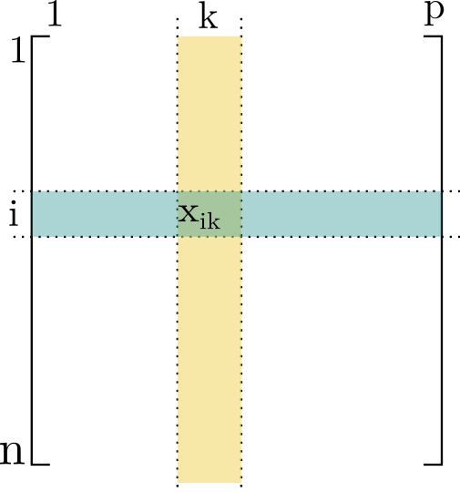
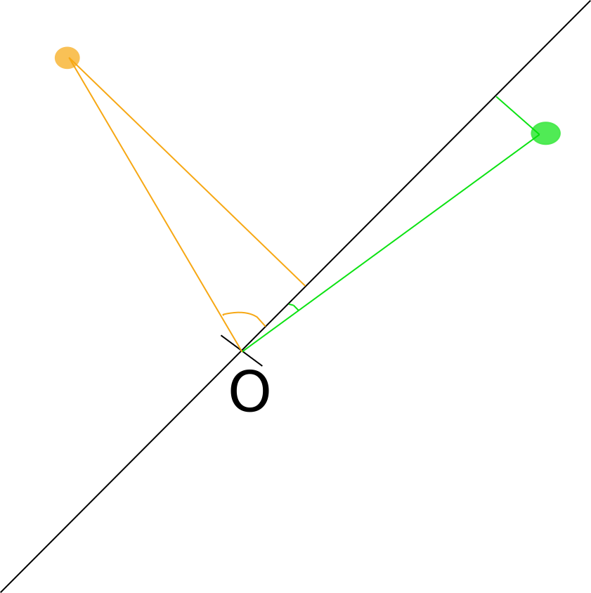

name: intro

<!-- F1D763 -->
<!-- F7A913 -->
<!-- C94326 -->
<!-- 1F908E -->
<!-- 33658A -->


```{r setup, include = FALSE,  eval = TRUE}
library('RefManageR')
source("../courses_tools/resources/knitr_setup.R")
main_dir <-  ''
common_img_dir <- file.path(main_dir,'courses_tools','resources', 'common_figs')
course_img_dir <- file.path(main_dir,'resources', 'figs')
BibOptions(check.entries = FALSE,
           bib.style = "authoryear",
           cite.style = "authoryear",
           style = "markdown",
           hyperlink = TRUE,
           max.names = 3,
           longnamesfirst= FALSE, 
           dashed = TRUE)
#myBib <- ReadBib('biblio_soutenance.bib', check = FALSE)
```

```{r xaringan-fit-screen, echo=FALSE}
xaringanExtra::use_fit_screen()
```


```{r datapackage, eval = TRUE, echo = FALSE, warning = FALSE}
library(plotly)
ggplot <- function(...) ggplot2::ggplot(...) + scale_fill_manual(values = wesanderson::wes_palette(name = "Darjeeling1")) + scale_color_manual(values = wesanderson::wes_palette(name = "Darjeeling1")) +  scale_fill_manual(values = wesanderson::wes_palette(name = "Darjeeling1")) + theme_minimal()
#remotes::install_github('MarieEtienne/coursesdata', force = TRUE)
doubs.env <- read.csv ('https://raw.githubusercontent.com/zdealveindy/anadat-r/master/data/DoubsEnv.csv', row.names = 1) %>% as_tibble()

data(penguins, package = 'palmerpenguins')
penguins <- penguins %>% na.omit()

```


# Introduction

--

## L'exemple des caractéristiques du Doubs 

On a mesuré les caractéristiques physico chimiques sur 30  sites différents le long de la rivière Doubs. 

.pull-left[ Les 6 premières lignes (parmi 30) du jeu de données doubs.env
```{r extrait_doubs, echo = FALSE, eval = TRUE}
doubs.env %>% print(n=6)
```
]


.pull-right[
* das :  distance à al source ( $km$ ),  
* alt : altitude ( $m$ )
* pen : la pente (denivelelé pour  1000m)
* deb : le débit () $m^3.s^{-1}$ )
* pH : le pH de l'eau,
* dur : la concentration en calcium ( $mg.L^{-1}$ ),
* pho	: concentration en phosphate ( $mg.L^{-1}$ ),
* nit : concentration en nitrate  ( $mg.L^{-1}$ ),
* amn	: concentration en ammonium ( $mg.L^{-1}$ ),
* oxy	: concentration d'oxygène dissous ( $mg.L^{-1}$ ), 
* dbo	: Demande biologique en oxygène ( $mg.L^{-1}$ ).
]


--
<p class="question"> Comment visualiser au mieux ces données pour faire apparaître les liens entre variables et identifier des resemblances entre individus ?</p>


---
template: intro

## L'exemple de la morphologie des manchots

On a mesuré les caractéristiques morphologiques de divers manchots :


.pull-left[ Les 6 premières lignes (parmi 333 ) du jeu de données doubs.env
 ```{r extrait_penguins, echo = FALSE, eval = TRUE}
 penguins %>% 
 select(bill_length_mm, bill_depth_mm, flipper_length_mm, body_mass_g) %>%  print(n=6)
```
]


.pull-right[

* bill_length_mm : la longueur du bec,

* bill_depth_mm : l'épaisseur du bec, 

* flipper_length_mm : la longueur de la nageoire,

* body_mass_g : le poids du corps.

]


--
<p class="question"> Comment visualiser au mieux ces données pour faire apparaître les liens entre variables et identifier des resemblances entre individus ?</p>

---
template: intro 
## Formalisation 

* Un individu statistique $i$, on a mesuré $n$ individus.   
* Pour chaque individu, on a  mesuré $p$ variables différentes.

Les données sont rangées dans un tableau à $n$ lignes et $p$ colonnes.

.pull-left[
```{r tab_pres, eval =TRUE, out.width = "80%"}

```
]

.pull-righ[
On note $x_{ik}$ la valeur mesurée pour la variable $k$ sur l'individu $i$,

et 

* $x_{\bullet k} = \frac{1}{n} \sum_{i=1}^n x_{ik}$ la valeur moyenne de la variable $k$,
* $s_k  = \sqrt{\frac{1}{n} \sum_{i=1}^n (x_{ik}-x_{\bullet k})^2}$ l'écart type de la variable  $k$,

]
 


---
template: intro

## Même question dans des domaines très variés

* Analyse sensorielle : note du descripteur $k$ pour le produit $i$

* Economie : valeur de l’indicateur $k$ pour l’année $i$

* Génomique : expression du gène $k$ pour l'e patient'échantilon  $i$

* Marketing : valeur d’indice de satisfaction $k$ pour la marque $i$

etc ...


--

On a $p$ variables mesurées sur $n$ individus et on souhaite visualiser ces données pour comprendre les liens entre variables et les proximités entre individus.

---
template: intro

## Voir c'est comprendre : comment représenter l'information contenue dans ce tableau ?

--

Idée 1 : on représente les liens des variables 2 à 2

```{r ggpairs, eval = TRUE, echo = FALSE, fig.show='asis', out.height = "80%", out.width = "80%"}
penguins %>% select(bill_length_mm, bill_depth_mm, flipper_length_mm, body_mass_g) %>% GGally::ggpairs()
```


---
template: intro

## Voir c'est comprendre : comment représenter l'information contenue dans ce tableau ?


Idée 1 : on représente les liens des variables 2 à 2

```{r gg_prog, eval = TRUE, echo = FALSE, fig.show='asis', out.height = "80%", out.width = "80%"}
penguins  %>% ggplot() + aes(x= body_mass_g, y = flipper_length_mm)  + geom_point() + xlab("Poids du corps") + ylab("Longuur nageoire")
```

--

On perd l'information sur les autres axes

---
template: intro

## Voir c'est comprendre : comment représenter l'information contenue dans ce tableau ?

Idée 1 : on représente les liens des variables 2 à 2

```{r gen_data,eval = TRUE, out.width = "100%"}
scene = list(camera = list(eye = list(x = -2, y = 0, z = 0)),
             center = list(x= mean(penguins$bill_depth_mm, y = mean(penguins$body_mass_g), z = mean(penguins$flipper_length_mm) )))
fig <- plot_ly(penguins, x = ~ bill_depth_mm, y = ~ -body_mass_g, z = ~flipper_length_mm, width = 500, height = 500) %>% 
  add_markers(size = 12)  %>% 
  layout(title = "3D Scatter plot", scene = scene)
fig
```


---
template: intro

.rouge[Objectif :]

* Représenter sans perdre trop d'information 
* idéalement des individus éloignés dans le nuage initial, restent éloignés dans la représentation.

--

.rouge[Ce qu'il nous faut :]

* quantifier l'information perdue dans la représentation 
* construire la représentation qui perd le moins d'information possible

--

.rouge[Précautions :] 

* pour rendre comparable des variables exprimées dans des unités différentes, on les centre et on les réduit

on définit les mesures centrées réduites 

$$x_{ik}' = \frac{x_{ik} - x_{\bullet k}}{s_k}$$

dans la suite, on omet le $\prime$ pour alléger l'écriture.


---

name: information

# Une mesure de la quantité d'information

--

## L'inertie du nuage de points 

Les données étant centrées, le point $O$ de coordonnées $(0, \ldots,0)$ est le centre du nuage de points.

.pull-left[
```{r penguins_centre, eval = TRUE}
penguins_centre <- penguins %>% select_if(is.numeric) %>% select(-year) %>% scale() %>% as_tibble()
fig <- plot_ly(penguins_centre, x = ~ bill_depth_mm, y = ~ - body_mass_g, z = ~flipper_length_mm, width = 500, height = 500)   %>% 
  add_markers(x=0, y= 0, z= 0, 
    showlegend = F) %>% 
  add_markers(size = 12) %>% 
  layout(title = "3D Scatter plot", scene = scene)
fig

```
]

.pull-right[
l'inertie quantifie l'nformation portée par le nuage

$$I =\frac{1}{n}  \sum_{i=1}^n d^2(x_{i}, 0) = \frac{1}{n}  \sum_{i=1}^n  \sum_{k=1}^p x_{ik}^2$$
.orange[Remarque :]

$$I =\sum_{k=1}^p  \left( \frac{1}{n}  \sum_{i=1}^n  x_{ik}^2 \right) = \sum_{k=1}^p  Var(x_{.k})$$
Si les variables sont réduites

$$I = p$$
]


---

template: information

## L'inertie portée par rapport à un axe $\Delta$  passant par $O$.


```{r penguins_centre_proj1, eval = TRUE, out.width = "60%"}
n <- nrow(penguins)
eig_res <- eigen(cor(penguins_centre[, c(4,3)]))
pc1 <- eig_res$vectors[, 1]
pc2 <- eig_res$vectors[, 2]
penguins_centre <- penguins %>% 
  select_if(is.numeric) %>% select(-year) %>% 
  scale()  %>% 
  as_tibble() 
penguins_centre %>% ggplot() + geom_point(aes(x  =  body_mass_g, y = flipper_length_mm))  + 
  geom_point(data=data.frame(x=0, y=0), aes(x=x,y=y), col = "red", size = 4) + 
  geom_segment(aes(x=-3*pc1[1], y=-3*pc1[2],  xend=3*pc1[1], yend=3*pc1[2]) , col = "red") + 
  annotate("text", x = 2, y = 1.8, label = "(Delta)", color = "red", parse = TRUE) +
  coord_fixed()

```

---

template: information

## L'inertie portée par rapport à un axe $\Delta$  passant par $O$.


```{r penguins_centre_proj_unique, eval = TRUE, out.width = "60%"}
penguins_simple <- penguins_centre %>% slice(c(1:3, 200:205))
P <- eig_res$vectors
Pt <-  t(P)
prov <- Pt%*% t(penguins_simple[,c(4,3)])
prov[2,] <- 0
prov <- t(P %*% prov) %>% as.data.frame()
colnames(prov ) <- c('V1', 'V2')

penguins_simple <- penguins_simple %>% add_column(prov)
penguins_simple %>% mutate(yproj = 0) %>% rowid_to_column() %>% 
  ggplot() + geom_point(aes(x  =  body_mass_g, y = flipper_length_mm))  + 
  geom_point(data=data.frame(x=0, y=0), aes(x=x,y=y), col = "red", size = 4) + 
  geom_segment(aes(x=-3*pc1[1], y=-3*pc1[2],  xend=3*pc1[1], yend=3*pc1[2]) , col = "red") + 
    annotate("text", x = 2, y = 1.8, label = "(Delta)", color = "red", parse = TRUE) +
  geom_point( aes(x  =  V1, y = V2), col= "red", alpha= 0.5) +
  geom_segment(aes(x = body_mass_g, xend=V1, y = flipper_length_mm, yend= V2), linetype = "dashed") +
  geom_text(aes(x=body_mass_g, y = flipper_length_mm+0.2,  label=paste0("x[", rowid, "]")), parse= TRUE) + coord_fixed()
  
```


L'inertie $I_{\Delta}$ quantifie l'nformation préservée sur la droite  et $I_{\Delta^\perp}= I - I_{\Delta}$ 
l'information perdue (merci Pythagore)

$$I_{\Delta} = \frac{1}{n} \sum_{i=1}^n d^2(\class{rouge}{x^{\Delta}_{i}}, 0)$$
$$I_{\Delta^\perp} =\frac{1}{n}  \sum_{i=1}^n d^2( \class{rouge}{x^{\Delta}_{i}}, x_{i})$$


---

name: construction

# Déterminer les meilleurs axes
 
--

## L'intuition 

### Situation simplifiée à 2 variables

```{r intuition, eval = TRUE, out.width = "60%"}
eig_res <- eigen(cor(penguins_centre[, c(4,3)]))
pc1 <- eig_res$vectors[, 1]
pc2 <- eig_res$vectors[, 2]

penguins_centre %>% ggplot() + geom_point(aes(x  =  body_mass_g, y = flipper_length_mm), alpha = 0.3)  + 
  geom_point(data=data.frame(x=0, y=0), aes(x=x,y=y), col = "red", size = 4) + 
  geom_segment(aes(x= 0, xend = 0, y = -3, yend = 3),  col = "#F1D763") +
  geom_segment(aes(x= -3, xend = 3, y = 0, yend = 0),  col = "#C94326")  +
  geom_segment(aes(x= - 4*pc1[1], xend = 4*pc1[1], y = -4*pc1[2], yend = 4*pc1[2]),  col = "#1F908E")
```

--


```{r inertia, eval = TRUE}
I1 <- sum(penguins_centre$body_mass_g^2)/nrow(penguins_centre)
I2 <- sum(penguins_centre$flipper_length_mm^2)/nrow(penguins_centre)
I3 <- eig_res$values[1]

```
.pull-left[

$$\class{rouge}{I_{\Delta} =  1}$$


$$\class{jaune}{I_{\Delta} =  1}$$


$$\class{vert}{I_{\Delta} =  1.89}$$
]
.pull-right[
L'inertie mesure la quatité d'information contenue dans les données

* Si on ne s'intéresse qu'à la variable poids du corps, on a 1 d'inertie.

* Si on ne s'intéresse qu'à la variable longueur des ailes, on a 1 d'inertie.

* Si on s'intéresse à la nouvelle variable (compromis entre le poids du corps et la longueur des ailes), on a 1.89. AVec une seule variable bien choisie, on représente presque toute l'information du jeu de données

]

---

template: construction


--
```{r acp_toy, eval = TRUE, echo  = FALSE, results='hide'}
small_dta <- penguins %>% select(body_mass_g, flipper_length_mm) %>% as.data.frame()
library(FactoMineR)
res_pca <- PCA(small_dta)
```

 
```{r concret, eval = TRUE, out.width = "50%"}
penguins_centre %>% ggplot() + geom_point(aes(x  =  body_mass_g, y = flipper_length_mm), alpha = 0.2)  + 
  coord_fixed() + 
  geom_point(data=data.frame(x=0, y=0), aes(x=x,y=y), col = "red", size = 4) + 
  geom_segment(aes(x=  0, xend = pc1[1], y =0, yend = pc1[2]),  arrow =  arrow(length = unit(0.4,"cm")),  col = "#1F908E") +
  geom_segment(aes(x=  0, xend = pc2[1], y =0, yend = pc2[2]),  arrow =  arrow(length = unit(0.4,"cm")),  col = "#F1D763") +
  coord_fixed()

```

---

template: construction


 
```{r concret_bis, eval = TRUE, out.width = "50%"}
ok  <- penguins %>% 
  add_column(res_pca$ind$coord[,1]) %>% 
  add_column(res_pca$ind$coord[,2]) %>% 
  rename(coord1 =  `res_pca$ind$coord[, 1]`) %>% 
  rename(coord2 =  `res_pca$ind$coord[, 2]`) 

ok %>% ggplot() + geom_point(aes(x  =  coord1, y = coord2), alpha = 0.2)  + 
  coord_fixed() + 
  geom_point(data=data.frame(x=0, y=0), aes(x=x,y=y), col = "red", size = 4) + 
  geom_segment(aes(x=  0, xend = 1, y =0, yend = 0),  arrow =  arrow(length = unit(0.4,"cm")),  col = "#1F908E") +
  geom_segment(aes(x=  0, xend = 0, y =0, yend = 1),  arrow =  arrow(length = unit(0.4,"cm")),  col = "#F1D763") +  geom_segment(aes(x=  0,, xend = res_pca$var$cor[1,1], y =0, yend = res_pca$var$cor[1,2]),  arrow =  arrow(length = unit(0.4,"cm")), col  ="#969696") +
   geom_segment(aes(x=  0, xend = res_pca$var$cor[2,1], y =0, yend = res_pca$var$cor[2,2]),  arrow =  arrow(length = unit(0.4,"cm")), col = "#969696") + coord_fixed() +
  annotate(geom = "text", x= res_pca$var$cor[1,1]+0.1,  y= res_pca$var$cor[1,2]+0.1, label ="V1") +
  annotate(geom = "text", x= res_pca$var$cor[2,1]+0.1,  y= res_pca$var$cor[2,2]+0.1, label ="V2") +
  annotate(geom = "text", x= 1.2,  y= 0, label ="CP1",  col = "#1F908E") +
  annotate(geom = "text", x= 0,  y= 1.1, label ="CP2",  col = "#F1D763") 

```


--

Les .rouge[composantes principales] sont des combinaisons linéaires des variables initiales

Bien sûr ça n'a pas d'intérêt dans le cas de deux variables 

---

template: construction

## ACP sur l'exemple des manchots 


```{r PCA_manchots, eval = TRUE, echo = TRUE}
library(FactoMineR)
dta <- penguins %>% select(bill_length_mm, bill_depth_mm, flipper_length_mm, body_mass_g) 
penguins.PCA <- PCA(X = dta, ncp = 4, graph = FALSE)
penguins.PCA$eig
```

---


template: construction

## ACP sur l'exemple des manchots 

```{r PCA_manchots_plot, eval = TRUE}
plot(penguins.PCA)
```

Il s'agit de la représentation en 2 dimensions qui déforment le moins possible le nuage global des points


 A l'aide de 2 dimensions seulement, on représente `r penguins.PCA$eig[1,2]` + `r penguins.PCA$eig[2,2]` de l'inertie totale.


---

name: interprétation

# Interprétation

--

## Qualité de la représentation des individus


.pull-lefts[
```{r quali_rep, eval =TRUE, out.width = "40%"}

```
]

--
.pull-rightb[

* Le cosinus (au carré pour éviter les questions de signe) de l'angle entre la composante principale est le vecteur $\vec{Ox_{i}}$ nous informe de la qualité de la représentation de l'individu.

* Pour mesurer la qualité de la représentation d'un individu sur le plan CP1, CP2, on additionne la qualité de la représentation sur chaque axe.

* On ne peut pas discuter des individus mal représentés

]


```{r acp_penguins_rep, eval = TRUE, out.width = "50%"}
ex <- penguins.PCA$ind$cos2 %>% as_tibble() %>% rowid_to_column %>% mutate(Plan.12= Dim.1 +Dim.2) %>% arrange(Plan.12) %>% slice(c(1:2, 332:333)) %>% pull(rowid)
penguins.PCA$ind$coord %>% as_tibble() %>% rowid_to_column  %>%  
  mutate(alpha = ifelse(rowid %in% ex, 1, 0.1)) %>% 
  mutate(couleur = ifelse(rowid %in% ex[1:2], "A", "B")) %>% 
  ggplot() + geom_point(aes(x= Dim.1, y = Dim.2, alpha =alpha, col = couleur)) + scale_color_manual(values = c("#C94326", "#1F908E")) + 
  theme(legend.position = "none")
```


---

template: interprétation


## Qualité de la représentation des variables 

De la même manière que pour les individus, on regarde l'angle entre les composantes principales et les variables

.pull-left[

Les $cos^2$ des variables :

```{r var_proj_cos2, echo = FALSE, eval = TRUE}
penguins.PCA$var$cos2 %>% as.data.frame() %>% 
  rownames_to_column()%>% select(Dim.1, Dim.2) %>% mutate(Plan.12 = Dim.1 + Dim.2) %>%
  arrange(Plan.12)
```
]

--

Le cercle des corrélations : 
```{r var_proj_quality, echo = TRUE, eval = TRUE, out.height = "40%"}
plot(penguins.PCA, choix = "var")
```


```{r var_proj}
plot(penguins.PCA, choix = "var")
```

---
template: interprétation


## Visualisation conjointe individus et variables sur le premier plan principal  1-2

```{r conjoint, eval =TRUE, out.width = "90%"}
p1 <- plot(penguins.PCA)
p2 <- plot(penguins.PCA, choix = "var")

ggpubr::ggarrange(nrow = 1, plotlist = list(p1,p2), ncol = 2)
```


---
template: interprétation


## Visualisation conjointe individus et variables sur le premier plan principal 3-4

```{r conjoint_bis, eval =TRUE, out.width = "90%"}
p1 <- plot(penguins.PCA, axes = c(3,4))
p2 <- plot(penguins.PCA, choix = "var", axes = c(3,4))

ggpubr::ggarrange(nrow = 1, plotlist = list(p1,p2), ncol = 2)
```


---
name: exemple

# L'exemple des caractéristiques du Doubs

--

## La projection sur le premier plan principal 

```{r doubs_PCA, echo = TRUE, eval = TRUE}
doubs.PCA <- PCA(doubs.env, graph = FALSE, ncp = 10)
p1 <- plot(doubs.PCA, axes = c(1,2))
p2 <- plot(doubs.PCA, choix = "var", axes = c(1, 2) )
ggpubr::ggarrange(nrow = 1, plotlist = list(p1,p2), ncol = 2)


```


---
template: exemple

--

##  Faut-il aller voir les autres composantes principales

```{r eigen_values, eval=TRUE}
doubs.PCA$eig %>% as.data.frame() %>% rownames_to_column() %>% mutate(rowname = factor(rowname, levels = paste0("comp ", 1:nrow(doubs.PCA$var$coord)))) %>%   ggplot() + geom_line(aes(x=rowname, y=eigenvalue, group=1)) + geom_point(aes(x=rowname, y=eigenvalue, group=1)) + xlab("Composante")
```
  

---
name: fin

# Pour finir en beauté

--

```{r factoshiny, echo = TRUE, eval=FALSE}
library(Factoshiny)
PCAshiny(penguins)
```


---

# Ce qu'il faut absolument savoir pour les TDs

* L'inertie mesure la quantité d'information.

* La valeur propre associée à une composante principale est l'inertie préservée par projection sur cette composante.

* L'ACP est un changement de repère pour projeter de façon pertinente donc les composantes principales sont des combinaisons linéaires des variables d'origine.

* On perd de l'information en projetant, malgré toutes nos précautions.

* Vérifier la qualité de la représentation des variables et des individus avant toute interprétation.

* Deux variables orthogonales, sont des variables ayant un coefficient de corrélation de 0.

* On peut interpréter plus que 2 axes.


```{r ggplot_back, echo = FALSE, eval = TRUE}
ggplot <- function(...) ggplot2::ggplot(...) 
```


