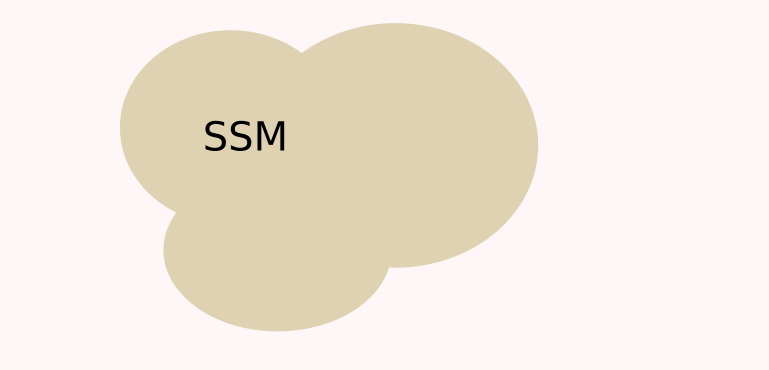
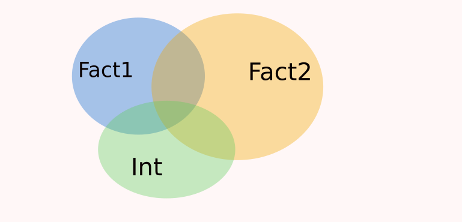
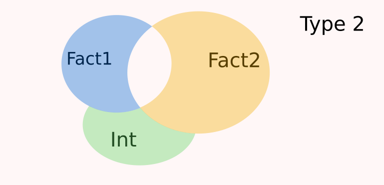
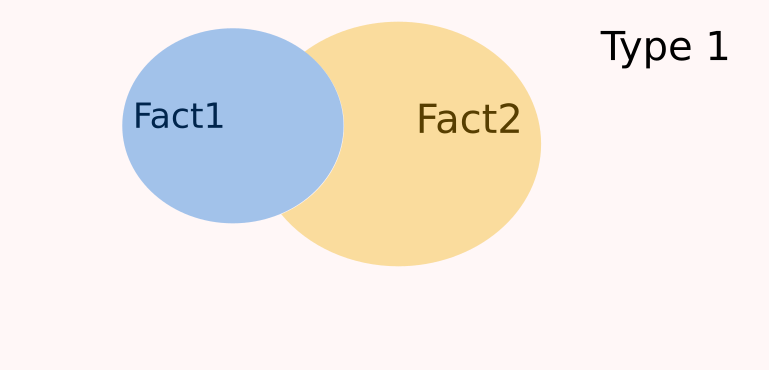
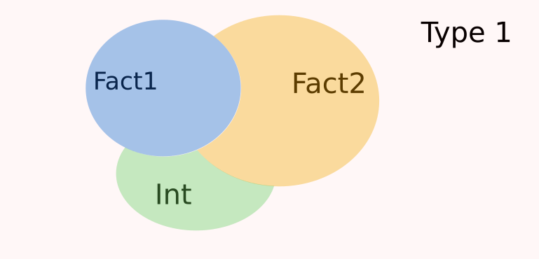
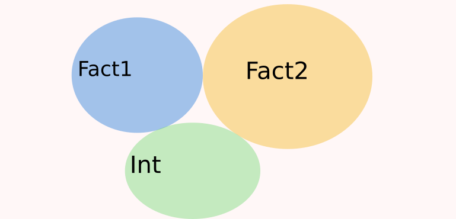

name: intro

<!-- F1D763 -->
<!-- F7A913 -->
<!-- C94326 -->
<!-- 1F908E -->
<!-- 33658A -->


```{r setup, include = FALSE,  eval = TRUE}
library('RefManageR')
source("../courses_tools/resources/knitr_setup.R")

common_img_dir <- file.path(main_dir,'courses_tools','resources', 'common_figs')
course_img_dir <- file.path(main_dir,'resources', 'figs')
BibOptions(check.entries = FALSE,
           bib.style = "authoryear",
           cite.style = "authoryear",
           style = "markdown",
           hyperlink = TRUE,
           max.names = 3,
           longnamesfirst= FALSE, 
           dashed = TRUE)
#myBib <- ReadBib('biblio_soutenance.bib', check = FALSE)
```

```{r xaringan-fit-screen, echo=FALSE}
xaringanExtra::use_fit_screen()
```


```{r datapackage, eval = TRUE, echo = FALSE, warning = FALSE}
ggplot <- function(...) ggplot2::ggplot(...) + scale_fill_manual(values = wesanderson::wes_palette(name = "Darjeeling1")) + scale_color_manual(values = wesanderson::wes_palette(name = "Darjeeling1")) +  scale_fill_manual(values = wesanderson::wes_palette(name = "Darjeeling1")) + theme_minimal()
#remotes::install_github('MarieEtienne/coursesdata', force = TRUE)
```


# Introduction

--

## Etude de la fréquence cardiaque au repos

On a mesuré la fréquence cardiaque de 20 femmes et 20 hommes ayantactivités de loisirs différentes.


```{r freqdata, eval=TRUE, echo=c(1,2), warning=FALSE}
freqdata <- read.csv('https://marieetienne.github.io/datasets/activite_FC.csv') %>% select(freqC, Activite, Sexe) %>% 
  mutate(Activite = factor(Activite, levels = c('Natation', 'Pilates', 'Pétanque'))) %>% arrange(Activite, Sexe)
freqdata %>% ggplot() +  aes(x= Sexe, y = freqC)+  geom_boxplot(aes(fill = Sexe, col = Sexe), alpha = 0.5) + theme(legend.position = 'none')  + 
  geom_jitter( size=0.8, alpha=0.7, width = 0.15, aes(col = as.factor(Sexe)))
freqdata %>% mutate(Activite_Fact = as.factor(Activite)) -> freqdata
```


--
<p class="question"> Les hommes et les femmes ont-ils la même fréquence cardiaque au repos ?</p>


---
template: intro
## Etude de la fréquence cardiaque au repos

En plus du sexe, il est possible que le type d'activité  influence également la fréquence cardiaque

```{r Activite, eval = TRUE, message=FALSE}
freqdata %>% mutate(Activite_Fact = as.factor(Activite)) -> freqdata
freqdata %>% ggplot() + aes(y = freqC, x = Activite_Fact, fill = Sexe) + geom_boxplot() + xlab('Activite') + ylab("Fréquence cardiaque")
```
--

On souhaite répondre aux questions suivantes:

.pull-left[
* Y a t il un effet du sexe ou de l'activite sur la fréquence cardiaque ? 

* Y a t il un effet du sexe  sur la fréquence cardiaque ? 
]

.pull-right[
* Y a t il un effet del'activite sur la fréquence cardiaque ? 

* L'effet de l'activite sur la fréquence cardiaque est-il le même pour les hommes et les femmes ? 
]
---
template: intro
## Cadre général du modèle d'analyse de la variance à 2 facteurs

On étudie le lien entre  
- une variable quantitative notée $Y$ (la fréquence cardiaque),
- et deux facteurs (variables qualitatives) pouvant prendre respectivement $I$ modalités (I=2 pour le Sexe)  et J modalités (J=5 pour le Activite)

Les données peuvent être visualisées à l'aide d'un boxplot.


--
On souhaite répondre aux questions suivantes:

.pull-left[
*  Y a t il un effet de l'un au moins des facteurs ?

* Y a t il un effet du facteur 1 ?]

.pull-right[

* Y a t il un effet du facteur 2 ?

* Y a t il une interaction entre ces deux facteurs ?
]


```{r anova_versiongraphique, eval = TRUE, echo = FALSE}
set.seed(222)
I <- 3
J <- 2
mu <- sort(round(4  * rnorm(I*J),2))
mu <- mu[c(1,2,4,3,5,6)]
mu_mat<- matrix(mu , ncol = J, nrow = I, byrow = TRUE)
effectif <- sample(10:30, size =  I*J, replace = TRUE)
fake_dta <- tibble( F1 = rep(rep(1:I, each=J), effectif),
                    F2 = rep(rep(1:J, I), effectif)) %>%
  group_by(F1, F2) %>% 
  mutate(group =(F2-1)*I + F1,
         m = mu_mat[group],
         y = round(rnorm(n(), mean = m, sd = 2),2) ) %>%
  mutate(F2 = as.character(F2), 
         F1 = as.character(F1), 
         ord=0)  

names(mu) <- paste('mu', rep(1:I, each=J), rep(1:J,I), sep ='_')

params <- fake_dta %>% 
  group_by(F1,F2) %>% 
  summarise(m =mean(m)) %>% 
  ungroup()
params_dessin <-  params %>% 
  mutate(x= c(0.65, 1.02, 1.65, 2.02, 2.65, 3.02),
         xend =x+ 0.33,
         y = m,
         yend= m)

p_comp_1 <- ggplot(data=fake_dta) + 
  ggtitle('Modèle Mcomp') +
  labs(x = 'F1', y = 'y') +
  geom_boxplot(aes(x=F1, y = y, fill = F1, linetype=F2), col = 'gray', alpha = 0.1) +
  geom_segment(data=params_dessin, aes(x=x, xend = xend, y = y, yend = yend, colour=F1, linetype = F2), lwd = 1.4)

  

norm_dta <- map_df(.x = mu, .f = function(m){
  dnorm(seq( min(mu) -3*2, max(mu)+ 3* 2, length.out = 100),
        mean = m, sd = 2)},
  .id = 'Groupe') %>% 
  mutate(x  = seq( min(mu) -3*2, max(mu)+ 3* 2, length.out = 100))  %>%
  pivot_longer(cols = starts_with("mu"), names_to = 'Groupe', values_to ='density' )%>% 
  mutate(F1= as.factor(str_remove(stringr::str_extract(Groupe, pattern = '[:digit:]_'), pattern = '_')),
         F2= as.factor(str_remove(stringr::str_extract(Groupe, pattern = '_[:digit:]$'), pattern = '_'))) %>% 
  mutate(abc = case_when(F1==1 ~ 0.80, 
                             F1==2~1.8,
                             F1==3~2.8),
         abcisse = ifelse(F2==2 , abc +0.35, abc)
         ) %>% 
  select(-abc)

```


---
name: model
# Le modèle d'analyse de la variance à 2 facteurs

--
## Graphiquement 

Une visualisation graphique du modèle d'analyse de la variance.

Dans l'hypothèse ou le sexe ou l'activité expliquent une partie de la variabilité de la fréquence cardiaque, comment imagine-t-on le processus aléatoire qui a conduit à nos données ?

--


```{r anova_graph_pcom_1t, fig.show='asis', eval=TRUE}
p_comp_1
```

---
template: model
# Le modèle d'analyse de la variance à 2 facteurs


## Graphiquement 

Une visualisation graphique du modèle d'analyse de la variance.

Dans l'hypothèse ou le sexe ou l'activité expliquent une partie de la variabilité de la fréquence cardiaque, comment imagine-t-on le processus aléatoire qui a conduit à nos données ?


```{r anova_graph_boxplot, fig.show='asis', eval = TRUE}
p_comp_1 + geom_point(data=norm_dta, aes(x=abcisse+density, y=x, col=F1, shape=F2), size = 0.5) +
  geom_point(data=fake_dta, aes(x=as.numeric(F1)+ifelse(F2==1, -0.15, +0.15), col = F1, shape = F2, y = y))
```


---

```{r anova_versiongraphique_anova2}
ggplot() + 
  xlab('y') +
  xlim(c(-10,11)) +
  ylim(c(0,0.25)) +
  ggtitle('Modèle Mcomp') +
  theme(legend.position = 'bottom')  + 
  geom_vline(data=fake_dta, aes(xintercept = m, col = F1, linetype = F2)) + #BREAK
  geom_line(data = norm_dta, aes(x= x, y = density, col = F1, linetype= F2 ))  + #BREAK
  geom_point(data = fake_dta, aes(x = y, col = F1, shape= F2, y=ord), size = 2, alpha = 0.7) 
```

```{r anova_versiongraphique_anova2_save, eval = TRUE}
pMcomp <- ggplot() + 
  xlab('y') +
  xlim(c(-10,11)) +
  ylim(c(0,0.25)) +
  ggtitle('Modèle Mcomp') +
  theme(legend.position = 'bottom')  + 
  geom_line(data = norm_dta, aes(x= x, y = density, col = F1, linetype= F2 ))  + #BREAK
  geom_vline(data=fake_dta, aes(xintercept = m, col = F1, linetype = F2)) + #BREAK
  geom_point(data = fake_dta, aes(x = y, col = F1, shape= F2, y=ord), size = 2, alpha = 0.7) 

```


`r chunk_reveal("anova_versiongraphique_anova2", break_type = "user", display_type="output")`

---
count:false

```{r anova_versiongraphique_anova2_fade, eval = TRUE, echo = FALSE}
ggplot() + 
  xlab('y') +
  xlim(c(-10,11)) +
  ylim(c(0,0.25)) +
  ggtitle('Modèle Mcomp') +
  theme(legend.position = 'bottom')  + 
  geom_line(data = norm_dta, aes(x= x, y = density, col = F1, linetype= F2 ), alpha =0.3)  + #BREAK
  geom_vline(data=fake_dta, aes(xintercept = m, col = F1, linetype = F2), alpha = 0.3) + #BREAK
  geom_point(data = fake_dta, aes(x = y, col = F1, shape= F2, y=ord), size = 2, alpha = 0.7) 
```


---


```{r anova_M0_prep, eval=TRUE}
mu0 <- mean(fake_dta$y)
sd0 <- sd(fake_dta$y)
norm_dta_M0 <- norm_dta %>%
  select(x, F1, F2) %>%
  mutate(mu0= mu0, sd = sd0, 
         density = dnorm(x, mean=mu0, sd=sd0))
```

```{r anova_versiongraphique_M0}

ggplot() + 
  xlab('y') +
  xlim(c(-10,11)) +
  ylim(c(0,0.25)) +
  ggtitle('Modèle M0') +
  theme(legend.position = 'bottom')  + 
  geom_line(data = norm_dta_M0, aes(x= x, y = density, col = F1, linetype= F2 ), alpha =0.3)  + #BREAK
  geom_vline(data=fake_dta, aes(xintercept = mu0, col = F1, linetype = F2), alpha = 0.3) + #BREAK
  geom_point(data = fake_dta, aes(x = y, col = F1, shape= F2, y=ord), size = 2, alpha = 0.7) 
```

`r chunk_reveal("anova_versiongraphique_M0", break_type = "user", display_type="output")`

```{r anova_versiongraphique_M0_save, eval = TRUE}
pM0 <-  ggplot() + 
  xlab('y') +
  xlim(c(-10,11)) +
  ylim(c(0,0.25)) +
  ggtitle('Modèle M0') +
  theme(legend.position = 'bottom')  + 
  geom_line(data = norm_dta_M0, aes(x= x, y = density, col = F1, linetype= F2 ), alpha =0.3)  + #BREAK
  geom_vline(data=fake_dta, aes(xintercept = mu0, col = F1, linetype = F2), alpha = 0.3) + #BREAK
  geom_point(data = fake_dta, aes(x = y, col = F1, shape= F2, y=ord), size = 2, alpha = 0.7) 

```


---
template: model

Lequel de ces mécanismes est le plus crédible au vu des donées ?

```{r compare_model_graph, eval = TRUE, echo = FALSE}
ggpubr::ggarrange(pMcomp, pM0, nrow = 1, common.legend = TRUE)
```


---
template: model

## Version régulière du modèle Mcomp

$$\class{alea}{Y_{ijk}} = \class{rouge}{\mu_{ij}} +\class{alea}{E_{ijk}},\quad \class{alea}{E_{ijk}}\overset{ind}{\sim}\mathcal{N}(0, \class{rouge}{\sigma^2}),$$
avec 
- $i=1,\ldots,I$ le niveau du facteur 1,
- $j=1,\ldots,J$ le niveau du facteur 2,
- $k= 1,\ldots, n_{ij}$ le numéro de l'individu dans le groupe $(i,j)$, 
- $n_{ij}$ le nombre d'individus dans le groupe $(i,j)$ et $n=\sum_ j\sum_i n_{ij}$ le nombre total d'individus,
- $\class{rouge}{\mu_{ij}}$ le comportement moyen du groupe $(i,j)$,
- $\class{rouge}{\sigma^2}$ la variance commune à tous les groupes.


### Nombre de paramètres du modèle

- $I*J$ paramètres de moyenne  $(\class{rouge}{\mu_{11}, \mu_{12}, \ldots,  \mu_{1J}, \ldots \mu_{IJ}})$; 
- 1 paramètre de variance $\class{rouge}{\sigma^2}$

---
template: model

## Version régulière du modèle Mcomp sur l'exemple 1
$$\class{alea}{Y_{ijk}} = \class{rouge}{\mu_{ij}} +\class{alea}{E_{ijk}},\quad \class{alea}{E_{ijk}}\overset{ind}{\sim}\mathcal{N}(0, \class{rouge}{\sigma^2}),$$
avec 
- $i=1,\ldots,3$ le niveau du facteur Activite,
- $j=1,\ldots,2$ le niveau du facteur Sexe,
- $k= 1,\ldots, 4$ le numéro de l'individu dans le groupe $(i,j)$, 
- $4$ le nombre d'individus dans le groupe $(i,j)$ et $n= 24=\sum_ j\sum_i n_{ij}$ le nombre total d'individus,
- $\class{rouge}{\mu_{ij}}$ le comportement moyen du groupe $(i,j)$,
- $\class{rouge}{\sigma^2}$ la variance commune à tous les groupes.


$I=3, J= 2$ 

### Nombre de paramètres
- 10 paramètres de moyenne
- 1 paramètre de variance

---
template: model
## Version singulière (détaillée) du modèle du modèle Mcomp

$$\class{alea}{Y_{ijk}} = \class{rouge}{\mu} + \class{rouge}{\alpha_i} + \class{rouge}{\beta_j} + \class{rouge}{\gamma_{ij}} +\class{alea}{E_{ijk}},\quad \class{alea}{E_{ijk}}\overset{ind}{\sim}\mathcal{N}(0, \class{rouge}{\sigma^2}),$$
avec 
- $i=1,\ldots,I$ le niveau du facteur 1,
- $j=1,\ldots,J$ le niveau du facteur 2,
- $k= 1,\ldots, n_{ij}$ le numéro de l'individu dans le groupe $(i,j)$, 
- $\class{rouge}{\mu}$  le comportement moyen de référence
- $\class{rouge}{\alpha_i}$  l'effet différentiel du niveau $i$ 
- $\class{rouge}{\beta_j}$  l'effet différentiel du niveau $j$ 
- $\class{rouge}{\gamma_{ij}}$  l'effet différentiel de la rencontre des niveaux $(i,j),$ (terme d'interaction)
- $\class{rouge}{\sigma^2}$ la variance commune à tous les groupes.


### Nombre de paramètres du modèle

- $1 + I + J + I*J$ paramètres de moyenne  
- 1 paramètre de variance $\class{rouge}{\sigma^2}$

--

#### La version dans les logiciels et qui permet de séparer les effets des différens facteurs.


---
template: model
## Lien entre les deux versions du même modèle

 <table style="width:100%">
  <tr>
    <th>Groupe</th>
    <th>V. régulière</th>
    <th>V. singulière</th>
  </tr>
  <tr>
    <td>1</td>
    <td> $\mu_{11}$ </td>
    <td> $\mu +\alpha_1 + \beta_1 + \gamma_{11}$ </td>
  </tr>
  <tr>
    <td>2</td>
    <td> $\mu_{12}$ </td>
    <td> $\mu +\alpha_1 + \beta_2 + \gamma_{12}$ </td>
  </tr>
    <tr>
    <td> </td>
    <td>  </td>
    <td>   </td>
  </tr>
  </tr>
    <tr>
    <td> </td>
    <td>  </td>
    <td>   </td>
  </tr>
  </tr>
    <tr>
    <td> </td>
    <td>  </td>
    <td>   </td>
  </tr>
    <tr>
    <td>I</td>
    <td> $\mu_{IJ}$ </td>
    <td> $\mu +\alpha_I +\beta_J +\gamma_{IJ}$ </td>
  </tr>
</table> 

--

<a class=care> Problème </a>  Le problème est identique au modèle d'analyse de la variance, le modèle sous cette forme est  <a style="font-weight:400;"> indéterminé</a>.

--

#### Solution : ajouter des contraintes
Par défaut dans R :
$\alpha_1=0,$  $\beta_1=0,$ et $\gamma_{1j}=0$ pour tous les $j$ et $\gamma_{i1}=0$ pour tous les $i$.

Ce qui correspond à $1 + 1 + J + (I-1)=I  + J +1$ contraintes. 

#### Nombre de paramètres 
- On a donc $1 + I + J + IJ$ paramètres dont $I  + J +1$ sont contraints, il reste donc
$IJ$ à estimer pour le comportement moyen
- 1 paramètre de variance $\sigma^2$.


---
template: model
## Lien entre les deux versions du même modèle

 <table style="width:100%">
  <tr>
    <th>Groupe</th>
    <th>V. régulière</th>
    <th>V. contrainte</th>
  </tr>
  <tr>
    <td>1</td>
    <td> $\mu_{11}$ </td>
    <td> $\mu $ </td>
  </tr>
  <tr>
    <td>2</td>
    <td> $\mu_{12}$ </td>
    <td> $\mu + \beta_2$ </td>
  </tr>
    <tr>
    <td> </td>
    <td>  </td>
    <td>   </td>
  </tr>
  </tr>
    <tr>
    <td> </td>
    <td>  </td>
    <td>   </td>
  </tr>
  </tr>
    <tr>
    <td> </td>
    <td>  </td>
    <td>   </td>
  </tr>
    <tr>
    <td>I</td>
    <td> $\mu_{IJ}$ </td>
    <td> $\mu +\alpha_I +\beta_J +\gamma_{IJ}$ </td>
  </tr>
</table> 


---
template: model
## Que signifient ces contraintes (à partir de l'exemple)

* Quelle est la fréquence moyennes des femmes nageuses ?

--

Les femmes nageuses forment le groupe  $(1,1)$ : en moyenne leur fréquence cardiaque est donnée par 
$$\mu +\alpha_1 +\beta_1 + \gamma_{11} = \mu.$$

* Quelle est la fréquence moyennes des hommes nageurs ?

--

Les hommes nageurs forment le groupe  $(1,2)$ : En moyenne leur fréquence cardiaque dans le modèle est 
$$\mu + \alpha_1 + \beta_2 +\gamma_{12} = \mu + \beta_2.$$
$\beta_2$ est donc l'effet différentiel du sexe $2$ (les hommes)   par rapport au sexe de référence $1$ (les femmes)   <a class=care> pour la natation</a>.

--

* Quelle est la fréquence cardiaque moyenne des femmes pratiquant la pétanque ?

--

Les femmes pratiquant la pétanque  forment le groupe  $(3,1)$ : En moyenne leur fréquence cardiaque dans le modèle est 

$$\mu + \alpha_3 + \beta_1 +\gamma_{31} = \mu + \alpha_3.$$

$\alpha_3$ est donc l'effet différentiel de l'activité 3 (la pétanque) par rapport à l'activité de référence 1 (la natation) pour le sexe 1 (les femmes).

--

Les valeurs des termes  $\gamma_{ij}$ sont difficiles à interpréter directement, on en reparlera dans les tests.


---
template: model
## Version contrainte du modèle Mcomp

$$\class{alea}{Y_{ijk}} = \class{rouge}{\mu} + \class{rouge}{\alpha_i} + \class{rouge}{\beta_j} + \class{rouge}{\gamma_{ij}} +\class{alea}{E_{ijk}},\quad \class{alea}{E_{ijk}}\overset{ind}{\sim}\mathcal{N}(0, \class{rouge}{\sigma^2}),$$
avec 
- $i=1,\ldots,I$ le niveau du facteur 1,
- $j=1,\ldots,J$ le niveau du facteur 2,
- $k= 1,\ldots, n_{ij}$ le numéro de l'individu dans le groupe $(i,j)$, 
- $\class{rouge}{\mu}$  le comportement moyen de référence
- $\class{rouge}{\alpha_i}$  l'effet différentiel du niveau $i$  pour $i= \class{rouge}{2},\ldots, I$
- $\class{rouge}{\beta_j}$  l'effet différentiel du niveau $j$ pour $j = \class{rouge}{2},\ldots, J$,
- $\class{rouge}{\gamma_{ij}}$  l'effet différentiel de la rencontre des niveaux $(i,j)$, pour $\class{rouge}{i\ne1}$ et $\class{rouge}{j\ne1}$ (terme d'interaction)
- $\class{rouge}{\sigma^2}$ la variance commune à tous les groupes.


### Nombre de paramètres du modèle

- $I*J$ paramètres de moyenne  
- 1 paramètre de variance $\class{rouge}{\sigma^2}$


#### La version dans les logiciels et qui permet de séparer les effets des différens facteurs.


---
template: model
## Sous forme matricielle
 $$\bf{\class{alea}{Y} = X\class{rouge}{\theta} + \class{alea}{E}}$$
### Forme régulière 

$$Y=\begin{pmatrix}
Y_{111}\\
Y_{112}\\
\vdots\\
Y_{11n_{11}}\\
Y_{121}\\
\vdots\\
Y_{12n_{12}}\\
\vdots\\
Y_{ijk}\\
\vdots\\
Y_{IJn_{IJ}}\end{pmatrix},
 \quad
{\bf{X}} =\overset{\color{gray}{\begin{matrix}\mu & \alpha_{2} &  \ldots & \alpha_{I} & $\beta_2 & \ldots &\beta_{J} & \gamma_{22} & \gamma_{23} & \ldots  &\gamma_{IJ}\end{matrix}}}{\begin{pmatrix}
1 & 0 & \ldots & 0 & 0 & \ldots 0 & 0 & 0 & \ldots 0\\
1 & 0 & \ldots & 0 & 0 & \ldots 0 & 0 & 0 & \ldots 0\\
\vdots\\
1 & 0 & \ldots & 0 & 0 & \ldots 0 & 0 & 0 & \ldots 0\\
1 & 0 & \ldots & 0 & 1 & \ldots 0 & 0 & 0 & \ldots 0\\
\vdots\\
1 & 0 & \ldots & 0 & 0 & \ldots 1 & 0 & 0 & \ldots 0\\
1 & 1 & \ldots & 0 & 0 & \ldots 0 & 0 & 0 & \ldots 0\\
\vdots\\
\vdots\\
\vdots\\
1 & 0 & \ldots & 1 & 0 & \ldots 1 & 0 & 0 & \ldots 1\\
 \end{pmatrix}},\quad
{\bf{\theta}} =\begin{pmatrix}
\mu\\
\alpha_2\\
\vdots\\
\alpha_I\\
\beta_2\\
\vdots\\
\beta_J \\
\gamma_{22} \\
\gamma_{23} \\
\vdots \\
\gamma_{IJ} \end{pmatrix}, \quad{\bf{E}} = \overset{}{\begin{pmatrix}
E_{111}\\
E_{112}\\
\vdots\\
E_{11n_{11}}\\
E_{121}\\
\vdots\\
E_{12n_{12}}\\
\vdots\\
E_{IJn_{IJ}}\end{pmatrix}}$$


---
template: model

## sur l'exemple de la fréquence cardiaque

.pull-left[
Les 10 premières lignes sont données par 
```{r head_FC, echo = FALSE, eval = TRUE}
freqdata %>% as_tibble() %>% print(n=10)
```

Ecrire la matrice $X$.

]

--
.pull-righ[
```{r m_comp_false, eval = TRUE, echo = TRUE, out.width="100%"}
Mcomp <- lm(freqC ~ Sexe + Activite + Sexe:Activite, data = freqdata)
model.matrix(Mcomp)[1:10, ]
```
]


---
template: model

## sur l'exemple de la fréquence cardiaque

*Reamrque, pas de colonne pour $\alpha_1, \beta_1, \gamma_{11}, \gamma_{12}, \gamma_{21}$ *

```{r m_comp, eval = TRUE, echo = TRUE}
Mcomp <- lm(freqC ~ Sexe + Activite_Fact + Sexe:Activite_Fact, data = freqdata)
model.matrix(Mcomp)
```

---
class: inverse
name: pause
#  Une petit pause ?
--

<br><br><br><br>
<p style="color:#33658a;font-size:35px;text-align:center;">Ok, prenons une petite pause !!!</p> 


---
name: parametre
# Estimation des paramètres
--

.pull-left[
###  Estimateur de $\class{rouge}{\theta}$ : $\class{alea}{T}$

$$\class{alea}{T} = \begin{pmatrix} \class{alea}{M} \\ \class{alea}{A_2} \\ \vdots  \\  \class{alea}{A_I} \\ \class{alea}{B_2} \\ \vdots\\ \class{alea}{B_J} \\ \class{alea}{G_{22}} \\ \vdots \\ \class{alea}{G_{IJ}}\\ \end{pmatrix} = (X^\intercal X )^{-1} X^\intercal \class{alea}{Y}$$

]

--

.pull-right[
### Estimation de $\class{rouge}{\theta}$ : $\class{fixe}{\hat{\theta}}$


$$\class{fixe}{\hat{\theta}}  = (X^\intercal X )^{-1} X^\intercal \class{fixe}{Y_{obs}} $$

]

--

### Loi de l'estimateur de $\class{rouge}{\theta}$


$$\class{alea}{T}  \sim \mathcal{N}_{IJ}\left(\class{rouge}{\theta}, \class{rouge}{\sigma^2} (X^\intercal X )^{-1}\right).$$


---
template: parametre
## Le paramètre de variance

L'estimateur de la somme des carrés résiduels s'écrit sous la forme 

$$RSS = || \class{alea}{Y}- X \, \class{alea}{T} ||^2 = \sum_{i=1}^{I} \sum_{j=1}^{J} \sum_{k=1}^{n_{ij}} \left \lbrace \class{alea}{Y_{ijk}} - (  \class{alea}{M} + \class{alea}{A_i} + \class{alea}{B_j} + \class{alea}{G_{ij}}) \right\rbrace ^2$$


### Estimateur de la variance 

  $$\class{alea}{S^2} =\frac{\class{alea}{RSS}}{DF_{res}} , $$
est un <a class=care> estimateur sans biais de  $\class{rouge}{\sigma^2}$ </a> .

Dans le cas du modèle d'analyse de la variance à 2 facteurs avec interactions  $DF_{res}=n-IJ$ (n observations et IJ paramètres de moyennes à estimer, le nombre de composantes dans le vecteur $\class{rouge}{\theta}$)

--

### Estimation de $\class{rouge}{\sigma^2}$

$$\class{fixe}{\hat{\sigma}}^2 =\frac{1}{n-IJ} \class{fixe}{RSS_{obs}},$$
$$\class{fixe}{RSS_{obs}} = || \class{fixe}{Y_{obs}}- X \, \class{fixe}{\hat{\theta}}  ||^2 =  \sum_{i=1}^{I} \sum_{j=1}^{J} \sum_{k=1}^{n_{ij}} \left \lbrace  \class{fixe}{y_k} - (\class{fixe}{\hat{\mu}} + \class{fixe}{\hat{\alpha}_i} + \class{fixe}{\hat{\beta}_j } + \class{fixe}{\hat{\gamma}_{ij}}   ) \right\rbrace ^2$$


---

template: pause


<br><br><br><br>
<p style="color:#33658a;font-size:35px;text-align:center;">Ok, prenons une petite pause !!!</p> 

---
name: modcomp
# Test du modèle complet


---
template: modcomp
## Rappel exemple fréquence cardiaque (exemple 1)

On a mesuré la fréquence cardiaque de 12 femmes et 12 hommes pratiquant des activités différentes


```{r freqdata2, ref.label='Activite', eval = TRUE, warning = FALSE, results ='markup'}
```


--
<p class="question"> Le sexe ou le type d'activité  sont ils liés à la fréquence carsdiaque au repos ?</p>


---
template: modcomp
## Sous forme de comparaison de modèle


```{r compare_model_graph2, ref.label='compare_model_graph', eval = TRUE, echo = FALSE, results='markup'}
```

--
<p class="question"> Le modèle Mcomp est il plus pertinent que le modèle M0 ?</p>


---
template: modcomp
## Hypothèses du test

On va donc opposer une hypothèse de travail $H_0$ contre une hypothèse alternative $H_1$. $H_0$ peut donc prendre différentes formes:


$$\begin{align} 
H_0 & =\left \lbrace \mbox{Pas de différence entre les différents groupes }\right\rbrace\\
    & =\left \lbrace  \mbox{pour tout }i, \alpha_i =0, \mbox{pour tout }j,\beta_j=0  \mbox{ et pour tout }(i,j),\gamma_{ij}=0   \right\rbrace\\
    & =\left \lbrace  M_{comp} \mbox{ est équivalent à } M0 \right\rbrace.
\end{align}$$

$H_1$ prend les formes équivalentes suivantes

$$\begin{align} 
H_1 & =\left \lbrace \mbox{Au moins 1 groupe est différent des autres}\right\rbrace\\
    & =\left \lbrace  \mbox{Il existe un }i, \alpha_i  \ne 0  \mbox{ ou un }j, \beta_j \ne 0 \mbox{ ou un } (i,j), \gamma_{ij} \ne 0  \right\rbrace\\
    & =\left \lbrace  M_{comp} \mbox{ est préférable à } M0 \right\rbrace.
\end{align}$$

--

Sous $H_0$, 
$$F= \frac{\frac{SS_{M_{comp}}}{IJ-1}}{\frac{RSS}{n-IJ}} \underset{H_0}{\sim}\mathcal{F}(IJ-1, n-IJ)$$  

---
template: modcomp
## Loi de la statistique de test sous $H_0$ - graphiquement

Sous $H_0$ la loi de distribution de $F$ est 

```{r p_value, eval = TRUE}
tibble(x = seq(0, 10, length.out = 2001)) %>% 
  mutate(y = df(x, df1 = 4, df= 38)) -> chi_dta
Fobs <- 1
chi_dta %>% filter(x> Fobs) %>% add_row(x=100,y = 0) %>%  add_row(x=Fobs, y =0)  %>% 
  add_row(x=Fobs, y =df(Fobs, df1 = 4, df= 38)) %>% arrange(x,y)  -> chi_dta_poly
```


```{r pvalue_graphique}
ggplot(data  = chi_dta) + xlab('y') + ylab('density') + geom_line(aes(x=x, y=y)) + #BREAK
  annotate("text", x = Fobs- 0.5, y = 0.05, label = "Fobs", col = 'red')+  geom_vline(aes(xintercept = Fobs), col = 'red') + #BREAK
  geom_polygon(data = chi_dta_poly,  aes(x=x, y= y), alpha = 0.3) + xlim(c(0, max(chi_dta$x))) 

```

---

`r chunk_reveal("pvalue_graphique", break_type = "user", display_type="output")`


---
template: pause

--
<br><br><br><br>
<p style="color:#33658a;font-size:35px;text-align:center;">Pas encore, non !!!</p> 


---
name: variance_decomposition
# Test des effets de chacun des facteurs : décomposition de SSM

---
template: variance_decomposition
## Visualisation graphique de la décomposition de la variance

<br>

- $RSS_0$ est schématisée par le rectangle  ci dessous.
- La partie rouge correspond à $RSS$, la partie blanche à $RSS_0 -RSS$, ce que l'on gagne à utilise rle modèle complet


<br>


```{r var_1, eval =TRUE, out.width = "55%"}

```

---
count:false
template: variance_decomposition
## Visualisation graphique de la décomposition de la variance

<br>

- $RSS_0$ est schématisée par le rectangle  ci dessous.
- La partie rouge correspond à $RSS$, la différence en blanc  à $RSS_0 -RSS$, ce que l'on gagne à utilise rle modèle complet

<br>

```{r var_2, eval =TRUE, out.width = "55%"}

```

---
count:false
template: variance_decomposition
## Visualisation graphique de la décomposition de la variance

<br>

- $RSS_0$ est schématisée par le rectangle  ci dessous.

- La partie  beige  $SSM= RSS_0 -RSS$, ce que l'on gagne à utiliser le modèle complet plutôt que $M_0$. 

On souhaite décomposer cette variabilité


```{r var_3, eval =TRUE, out.width = "55%"}

```


---
template: variance_decomposition
## Comment mesurer la variabilité capturée par chaque facteur ?

On veut décomposer la variabilité attribuée au modèle selon les différentes sources.

Considérons les différents modèles possibles

$$\begin{align}
M_0\ :\ Y_{ijk} &= \mu + E_{ijk}\\
M_{1}\ :\ Y_{ijk} &= \mu + \alpha_i + E_{ijk}\\
M_{2}\ :\ Y_{ijk} &= \mu + \beta_j + E_{ijk}\\
M_{12}\ :\ Y_{ijk} &= \mu + \alpha_i + \beta_j + E_{ijk}\\
M_{comp}\ :\ Y_{ijk} &= \mu + \alpha_i + \beta_j +\gamma_{ij} + E_{ijk}\\
\end{align}$$


--


* $RSS_2 - RSS_{12}$ mesure ce que l'on gagne à utiliser le modèle $M_{12}$ plutôt que $M_2$, c'est l'effet du facteur 2 après s'être ajusté au facteur 1

* $RSS_1 - RSS_{12}$ mesure ce que l'on gagne à utiliser le modèle $M_{12}$ plutôt que $M_1$, c'est l'effet du facteur 2 après s'être ajusté au facteur 2

* $RSS_{12} - RSS_{comp}$ mesure ce que l'on gagne à utiliser le modèle $M_{comp}$ plutôt que $M_{12}$, c'est l'effet de l'interaction, les effets principaux étant pris en compte.


---
template: variance_decomposition
## Comment mesurer la variabilité capturée par chaque facteur ?

### Réduction de variabilité

$$\begin{align}
SSM & = RSS_0 - RSS_{comp}\\
SSM & = \underbrace{RSS_0 - RSS_{1}}_{R(\alpha\vert \mu )} + \underbrace{{RSS_1 - RSS_{12}}}_{R(\beta\vert \mu, \alpha )} + \underbrace{RSS_{12} - RSS_{comp}}_{R(\gamma\vert \mu, \alpha,\beta )} \\
SSM & = \underbrace{RSS_0 - RSS_{2}}_{R(\beta\vert \mu )} + \underbrace{{RSS_2 - RSS_{12}}}_{R(\alpha\vert \mu, \beta )} + \underbrace{RSS_{12} - RSS_{comp}}_{R(\gamma\vert \mu, \alpha,\beta )} \\
\end{align}$$


--

On a fait un choix pour les parties confondues

```{r var_5, eval =TRUE, out.width = "55%"}

```


---
template: variance_decomposition
## Mathématiquement

On veut décomposer la variabilité attribuée au modèle selon les différentes sources.

Considérons les différents modèles possibles

$$\begin{align}
M_0\ :\ Y_{ijk} &= \mu + E_{ijk}\\
M_{1}\ :\ Y_{ijk} &= \mu + \alpha_i + E_{ijk}\\
M_{2}\ :\ Y_{ijk} &= \mu + \beta_j + E_{ijk}\\
M_{12}\ :\ Y_{ijk} &= \mu + \alpha_i + \beta_j + E_{ijk}\\
M_{comp}\ :\ Y_{ijk} &= \mu + \alpha_i + \beta_j +\gamma_{ij} + E_{ijk}\\
\end{align}$$

--

<a class = question> Comment mesurer l'effet des différents facteurs</a> 

--

Mesurer la réduction de variabilité liée à la prise en compte d'un facteur.


---
count: false
template: variance_decomposition
## Réduction de variabilité

$$\begin{align}
SSM & = RSS_0 - RSS_{comp}\\
SSM & = \underbrace{RSS_0 - RSS_{1}}_{R(\alpha\vert \mu )} + \underbrace{RSS_1 - RSS_{12}}_{R(\beta\vert\alpha,\mu)} + {RSS_{12} - RSS_{comp}} \\
\end{align}$$


```{r var_beta, eval =TRUE, out.width = "55%"}

```


---
count: false
template: variance_decomposition
## Réduction de variabilité

$$\begin{align}
SSM & = RSS_0 - RSS_{comp}\\
SSM & = \underbrace{RSS_0 - RSS_{1}}_{R(\alpha\vert \mu )} + \underbrace{RSS_1 - RSS_{12}}_{R(\beta\vert\alpha,\mu)} + \underbrace{RSS_{12} - RSS_{comp}}_{R(\gamma\vert \beta, \alpha, \mu)} \\
\end{align}$$


```{r var_tot, eval =TRUE, out.width = "55%"}

```


---
template: variance_decomposition
## Décomposition de type 1

Rôle asymétrique des facteurs (l'ordre des facteurs importe).

--

## Décomposition de type 2

But : symétriser le rôle des différents facteurs

```{r var_tot_2, eval =TRUE, out.width = "45%"}

```


---
template: variance_decomposition
## Test de type 2

 <table style="width:100%">
  <tr>
    <th>Source</th>
    <th>H0</th>
    <th>SS</th>
    <th>Df</th>
    <th>F</th>
  </tr>
  <tr>
    <th> F1 </th>
    <th> M2 et M12 sont équivalents </th>
    <th> $R(\alpha\vert \beta, \mu)$ </th>
    <th> $I-1$ </th>
    <th> $$\frac{\frac{R(\alpha\vert\beta, \mu)}{I-1}}{\frac{RSS}{n-IJ}}$$ </th>
</tr>
<tr>
    <th> F2 </th>
    <th> M1 et M12 sont équivalents </th>
    <th> $R(\beta\vert\alpha, \mu)$ </th>
    <th> $J-1$ </th>
    <th> $$\frac{\frac{R(\beta\vert \alpha, \mu)}{J-1}}{\frac{RSS}{n-IJ}}$$ </th>
</tr>
<tr>
    <th> Inter </th>
    <th> M12 et Mcomp sont équivalents </th>
    <th> $R(\gamma\vert \beta, \alpha, \mu)$ </th>
    <th> $(J-1)(J-1)$ </th>
    <th> $$\frac{\frac{R(\gamma\vert \beta, \alpha, \mu)}{(I-1)(J-1)}}{\frac{RSS}{n-IJ}}$$ </th>
</tr>
</table> 

---
template: variance_decomposition
## L'exemple des fréquences cardiaque

Il s'agit du cas particulier $n_{ij}$ sont tous égaux. Le plan d'expérience est dit **équilibré**, pas de variabilité confondue.


```{r var_eq, eval =TRUE, out.width = "45%"}

```


---
template: variance_decomposition
## L'exemple des fréquences cardiaque

On examine d'abord l'interaction 

```{r freq_comp2, eval = TRUE, echo =TRUE}
library(car)
Anova(Mcomp, type = 2)
```

--
 Si l'interaction n'avait pas été significative, on aurait ajuster à nouveau le modèle sans interaction et tester l'effet de chacun des facteurs principaux.

---
name: comp_moyenne
# Comparaison des différents groupes
--
## Moyennes ajustées

C'est la moyenne qu'on observerait dans un plan d'expérience équilibré

$$\tilde{\mu}_{i.} = \mu + \alpha_i + \frac{1}{J}\sum_{j=1}^J (\beta_j +\gamma_{ij}).$$
$$\tilde{\mu}_{.j} = \mu + \beta_j + \frac{1}{I}\sum_{i=1}^I (\alpha_i +\gamma_{ij}).$$


--

$$\tilde{\mu}_{1.}-\tilde{\mu}_{2.} =  \alpha_1  -\alpha_{2}+ \frac{1}{J}\sum_{j=1}^J (\gamma_{1j} -\gamma_{2j}).$$

---
template: comp_moyenne

## Moyennes ajustées pour le sexe

```{r moy_ajustees, eval= TRUE, echo =TRUE}
library(emmeans)
m_ajust_sexe <- emmeans(Mcomp, "Sexe")
pairs(m_ajust_sexe)
plot(m_ajust_sexe)
```


---

template: comp_moyenne
## Moyennes ajustées pour l'activité

```{r moy_ajustees_Activite, eval= TRUE, echo =TRUE}
m_ajust_Activite <- emmeans(Mcomp, "Activite_Fact")
summary(pairs(m_ajust_Activite))
```

---

template: comp_moyenne
## Moyennes ajustées pour l'activité

```{r ajuste_Activite_graph, eval = TRUE}
plot(m_ajust_Activite)
```
---
template: pause

--
<br><br><br><br>
<p style="color:#33658a;font-size:35px;text-align:center;">Ok, prenons une petite pause !!!</p> 


---
name: ancova
# Comparaison de droite de régression : modèle d'analyse de la covariance

--
## Cadre général
C'est la situation où 
* la variable à expliquer $Y$ est quantitative
* Les variables explicatives sont qualitatives et quantitatives

```{r load_penguins, echo = FALSE, eval = TRUE}
library(palmerpenguins)
data("penguins")
penguins %>% 
  ggplot() + geom_point(aes(x=bill_length_mm, y = bill_depth_mm, col = species))+
  geom_smooth(method = 'lm', aes(x=bill_length_mm, y = bill_depth_mm, col = species), se = FALSE)
```

--- 
template: ancova
## Le modèle

$$\class{alea}{Y_{ik}} = \class{rouge}{\mu} + \class{rouge}{\alpha_i} + \class{rouge}{\beta}x_{ik} +\class{rouge}{\gamma_i} x_{ik} + \class{alea}{E_{ik}},\quad \class{alea}{E_{ik}}\overset{ind}{\sim}\mathcal{N}(0, \class{rouge}{\sigma^2}),$$
avec 
- $i=1,\ldots,I$ le niveau du facteur 1,
- $x_{ik}$ la mesure de la variable quantitative $x$ sur l'individu $k$ du groupe $i$, 
- $\class{rouge}{\mu}$ l'ordonnée à l'origine de référence,
- $\class{rouge}{\alpha_i}$ l'effet différentiel de l'espèce $i$ sur l'ordonnée à l'origine, 
- $\class{rouge}{\beta}$ l'effet de la variable $x$ pour le groupe de référence,   
- $\class{rouge}{\gamma_i}$ l'effet différentiel de la variable $x$ pour le groupe $i$ par rapport au groupe de référence,  
- $\class{rouge}{\sigma^2}$ la variance commune à tous les groupes.


### Nombre de paramètres du modèle

- $2I$ paramètres de moyenne  $(\class{rouge}{(\mu, \alpha_2, \ldots, \alpha_I, \beta, \gamma_2, \ldots, \gamma_I)}$; 
- 1 paramètre de variance $\class{rouge}{\sigma^2}$


--- 
template: ancova
## Comment tester

* L'égalité de toutes les pentes  ?

* Comment mesurer l'effet de l'espèce ?

* Comment mesurer l'effet de la longueur du bec ?


---
template: ancova

Que teste t on en faisant ?

1. 

```{r penguins_lm1, echo = TRUE, eval = TRUE}
Mcomp <- lm(bill_depth_mm ~ species + bill_length_mm + species:bill_length_mm, data =penguins)
M0 <- lm(bill_depth_mm ~ 1, data =penguins)
anova(M0, Mcomp)
```

2. 


```{r penguins_lm2, echo = TRUE, eval = TRUE}
Mcomp <- lm(bill_depth_mm ~ species + bill_length_mm + species:bill_length_mm, data =penguins)
M12 <- lm(bill_depth_mm ~ species + bill_length_mm , data =penguins)
anova(M12, Mcomp)
```


--- 
template: ancova

Que teste t on en faisant ?

3.


```{r penguins_lm3, echo = TRUE, eval = TRUE}
Anova(Mcomp)
```


---
# Ce qu'il faut absolument savoir pour les TDs

- savoir reconnaître une situtation d'e régression multiple
'analyse de la variance à deux facteurs

--
  * On cherche à comprendre le lien entre une variable d'intérêt $Y$ et deux variables explicatives qualitatives.
  
--

- savoir écrire le modèle d'analyse de la variance à deux facteurs

--
- Tester l'existence de l'effet d'au moins un des facteurs 

--
- Tester l'existence de l'effet d'un facteur en particulier

--

- Reconnaître une situation d'analyse de la covariance

--

- Savoir adapter ce qu'on a fait en analyse de la variance au cas de l'analyse de la covariance


```{r ggplot_back, echo = FALSE, eval = TRUE}
ggplot <- function(...) ggplot2::ggplot(...) 
```


