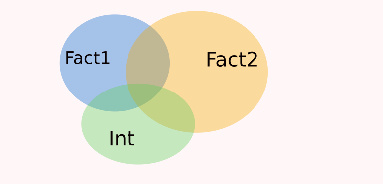

name: intro

<!-- F1D763 -->
<!-- F7A913 -->
<!-- C94326 -->
<!-- 1F908E -->
<!-- 33658A -->


```{r setup, include = FALSE,  eval = TRUE}
library('RefManageR')
library('tidyverse')
main_dir <-  '..'
common_img_dir <- file.path(main_dir,'courses_tools','resources', 'common_figs')
course_img_dir <- file.path(main_dir,'resources', 'figs')
BibOptions(check.entries = FALSE,
           bib.style = "authoryear",
           cite.style = "authoryear",
           style = "markdown",
           hyperlink = TRUE,
           max.names = 3,
           longnamesfirst= FALSE, 
           dashed = TRUE)
#myBib <- ReadBib('biblio_soutenance.bib', check = FALSE)
```

```{r xaringan-fit-screen, echo=FALSE}
xaringanExtra::use_fit_screen()
```


# Introduction : Importance du design expérimental 

--
## Retour sur un exemple : le gras du cochon !

.pull-left[
```{r gras, echo = FALSE, eval = TRUE}
dta <-  read.table("https://dcauseur.netlify.app/teaching/data/pig.txt",header=TRUE,stringsAsFactors=TRUE) %>% 
  as_tibble() %>% 
  dplyr::select(BFAT, GENET) %>% 
  filter(GENET %in% c("P25", "P0")) %>% 
  mutate(GENET = droplevels(GENET))
dta %>% summary()
```
]


--

.pull-right[

* Ces données sont modélisées par $$Y_{ik} = \mu_i + E_{ik}$$ 

* Intérêt pour $\delta = \mu_1-\mu_2$ 

  - Estimation de $\delta$ par $\hat{\delta}$
  - Loi de l'estimateur $D$ de $\delta$ : $\mathcal{N}\left (\delta, \sigma^2 \left(\frac{1}{n_2}+\frac{1}{n_1}\right)\right)$

* Dans l'exemple $n_1=15$, $n_2=23$, donc  $\frac{1}{n_1}+\frac{1}{n_2}= 0.110$
]

--
.pull-right[

* Si $n_1=19$  et $n_2=19$,  $\frac{1}{n_1}+\frac{1}{n_2}= 0.105$
]

--

$$IC_{1-\alpha}(\delta)= \left[ \hat{\delta} - q_{1-\alpha/2} \hat{\sigma} \class{vert}{\sqrt{\frac{1}{n_1} +\frac{1}{n_2}}} ; 
\hat{\delta} + q_{1-\alpha/2} \hat{\sigma} \class{vert}{\sqrt{\frac{1}{n_1} +\frac{1}{n_2}}} \right]$$

--

.rouge[ Gain en précision avec un design experimental bien choisi]

---
template: intro

## Retour sur la fréquence cardiaque et l'activité sportive

.pull-left[

```{r freqdata, eval=TRUE,  warning=FALSE, message = FALSE, echo = FALSE }
freqdata <- read.csv('https://marieetienne.github.io/datasets/activite_FC.csv', stringsAsFactors = TRUE) %>% 
  dplyr::select(freqC, Activite, Sexe) %>% 
  mutate(Activite = factor(Activite, levels = c('Natation', 'Pilates', 'Pétanque'))) %>% arrange(Activite, Sexe) %>% 
  dplyr::filter(Activite %in% c("Pilates", "Natation"))  %>% mutate(Activite = droplevels(Activite))
freqdata %>% group_by(Activite, Sexe) %>% summarise(nobs = n())
```
]

--

.pull-right[

* Ces données sont modélisées par $$Y_{ik} = \mu + \alpha_i + \beta_j + \gamma_{ij}+ E_{ik},$$  
cas particulier de $$Y=X\theta +E.$$

* Loi d l'estimateur $T$ de $\theta$:  $\mathcal{N}\left(\theta, \sigma^2 (X^{\intercal} X)^{-1}\right)$

]

--

* $n_{ij}=4$, pour tout $i,j$. Plan d'expérience **équilibré** :séparation complète de la variabilité associée à l'effet du Sexe et de l'Activité.


```{r var_eq, eval =TRUE, echo = FALSE,  out.width = "40%"}
knitr::include_graphics('./RSS3_eq.png')
```

---

template: intro

## Retour sur la fréquence cardiaque et l'activité sportive


.pull-left[

* Que se passe-t-il si, dans notre expérience, on a le design suivant ?


```{r freqdata_2, eval=TRUE,  warning=FALSE, message = FALSE, echo = FALSE }
freqdata %>% group_by(Activite, Sexe) %>% summarise(nobs = n()) %>% ungroup() %>% mutate(nobs= c(8,0,0,8))
```


```{r var_counfound, eval =TRUE, echo = FALSE,  out.width = "80%"}

```

et $X^{\intercal} X$ n'est pas inversible (ereur dans les sorties R *aliased coefficient*)

]
--

.pull-right[

* Cas général : quand les effets ne sont ni complètement confondus ni tout à fait séparés.

```{r var_qqc, eval =TRUE, echo = FALSE,  out.width = "80%"}

```

]


--

.rouge[Le design expérimental est essentiel et doit être réfléchi en amont]


---
template: intro

## Retour sur la fréquence cardiaque et l'activité sportive

Plan d'expérience : 
```{r freqdata, eval=TRUE,  warning=FALSE, message = FALSE, echo = FALSE }
```

* Combien de paramètres à estimer dans le modèle suivant ?  $$Y_{ik} = \mu + \alpha_i + \beta_j + \gamma_{ij}+ E_{ik},$$  

--

* $$DDL_{Res} =  ,$$ 

--

* Que se passerait-il si on avait exactement 4 observations ?

--
.rouge[Le modèle qui contient autant de paramètres que d'observations est appelé  modèle] .care[saturé].


---
template: intro

## Exemple de problème de design expérimental  : La Galette !

.vert[Objectif :] Réduire le nombre de galettes déchirées lorsqu'on les déplie


.pull-left[

Plusieurs aspects clés dans la recette :

  * Quantité d'eau (45%, 55%)
  * Température de cuisson (180, 220)
  * Etalement de la pâte (automatique, manuel)
  * Quantité de pâte déposée (55g, 65g)
  * Farine (bio, traditionnelle)
  * Pliage (à chaud, à froid)
  * Température de stockage (6 ou 15 degrés)

]

.pull-right[  
.vert[7 facteurs à deux modalités]
]
--

.center[
Combien de combinaisons possibles    
  
  * si on veut étudier .rouge[2] facteurs : 
  * si on veut étudier .rouge[3] facteurs : 
  * si on veut étudier .rouge[4] facteurs  :
]

---
template: intro

## Exemple de problème de design expérimental  : La Galette !

.vert[Objectif :] Réduire le nombre de galettes déchirées lorsqu'on les déplie

.pull-left[

Plusieurs aspects clés dans la recette :

  * Quantité d'eau (45%, 55%)
  * Température de cuisson (180, 220)
  * Etalement de la pâte (automatique, manuel)
  * Quantité de pâte déposée (55g, 65g)
  * Farine (bio, traditionnelle)
  * Pliage (à chaud, à froid)
  * Température de stockage (6 ou 15 degrés)

]

.pull-right[  
.vert[7 facteurs à deux modalités]
]


.center[
Combien de combinaisons possibles    
  
  * si on veut étudier .rouge[2] facteurs : $2^{\class{rouge}{2}}$
  * si on veut étudier .rouge[3] facteurs : $2^{\class{rouge}{3}}$
  * si on veut étudier .rouge[4] facteurs  : $2^{\class{rouge}{4}}$
  * si on veut étudier .rouge[7] facteurs  : $2^{\class{rouge}{7}}$
]


.care[Dans toute la suite, on va considérer des facteurs à 2 niveaux seulement.]


---
name: plan_complet
# Les plans factoriels complets $2^p$

--

## Cas de 2 facteurs : plan $2^2$

On note $A$ le facteur 1 et $B$ le facteur 2. Les modalités sont notées $1$ et $-1$. 

On a $2^2$ expériences différentes possibles:

### Matrice des essais

.pull-left[
$$\begin{pmatrix} 
+1 & +1 \\
+1 & -1 \\
-1 & +1 \\
-1 & -1 \\
\end{pmatrix}$$

] 

--

.pull-right[

A : Quantité d'eau, B : Pliage

* Essai 1 : 45% d'eau , pliage à chaud
* Essai 2 : 45% d'eau , pliage à froid
* Essai 3 : 55% d'eau , pliage à chaud
* Essai 4 : 55% d'eau , pliage à froid

]


---

template: plan_complet

## Cas de 2 facteurs : plan $2^2$

On note $A$ le facteur 1 et $B$ le facteur 2. Les modalités sont notées $1$ et $-1$. 

On a $2^2$ expériences différentes possibles: on peut estimer $2^2$ paramètres.
--


Modèle d'analyse de la variance à 2 facteurs avec interaction  


$$Y_{ij} = \mu + \alpha_i +\beta_j + \gamma_{ij} + E_{ij},$$
#### Matrice de design, matrice des effets

C'est la matrice $X$ dans le modèle qui est utilisé : $$Y = X\theta + E$$

.pull-left[

avec  les contraintes classiques de R : $\alpha_1=\beta_1=\gamma_{11}=\gamma_{12}=\gamma_{21}=0.$ ]

.pull-right[

$$X = \overset{\color{gray}{\begin{matrix}\mu & \alpha_{2} & \beta_2 & \gamma_{22}\end{matrix}}}{\begin{pmatrix}
1 & 0 & 0 & 0\\
1 & 0 & 1 & 0\\
1 & 1 & 0 & 0\\
1 & 1 & 1 & 1\\
 \end{pmatrix}},\quad \theta =\begin{pmatrix}\mu \\ \alpha_2 \\ \beta_2 \\ \gamma_{22} \end{pmatrix}$$

] 

--

Mais peu pratique dans le cadre des plans d'expérience.

.rouge[En acceptant de changer de système de contraintes, on pourra travailler plus facilement avec les plans !]


---

template: plan_complet


## Un petit retour sur l'analyse de la variance à 2 facteurs et au-delà


$$Y_{ij} = \mu + \alpha_i +\beta_j + \gamma_{ij} + E_{ij},$$ 
   système de contraintes pour s'assurer que le modèle ne contient pas de paramètres inutiles

.pull-left[
.orange[Les contraintes classiques]

.font80[
et $\alpha_1=\beta_1=\gamma_{11}=\gamma_{12}=\gamma_{21}=0.$ 

$$X = \overset{\color{gray}{\begin{matrix}\mu & \alpha_{2} & \beta_2 & \gamma_{22}\end{matrix}}}{\begin{pmatrix}
1 & 0 & 0 & 0\\
1 & 0 & 1 & 0\\
1 & 1 & 0 & 0\\
1 & 1 & 1 & 1\\
 \end{pmatrix}},\quad \theta =\begin{pmatrix}\mu \\ \alpha_2 \\ \beta_2 \\ \gamma_{22} \end{pmatrix}$$
]
]

--


.pull-right[
.orange[Système alternatif commode pour  plans d'expérience]

.font80[ $\alpha_1 = -\alpha_2; \beta_1 = -\beta_2, \gamma_{11}=\gamma_{22}=-\gamma_{12}=-\gamma_{21};$

$$X = \overset{\color{gray}{\begin{matrix}\ \mu \hspace{.3cm}& \ \alpha_{1} \hspace{.3cm}& \ \beta_1 \hspace{.3cm}& \ \gamma_{11}\hspace{.3cm}\end{matrix}}}{\begin{pmatrix}
\ 1 & \ 1 & 1 & 1\\
\ 1 & \ 1 & -1 & -1\\
\ 1 & -1 & 1 & -1\\
\ 1 & -1 & -1 & 1\\
 \end{pmatrix}},\quad \theta =\begin{pmatrix}\mu \\ \alpha_1 \\ \beta_1 \\ \gamma_{11} \end{pmatrix}$$
]

] 

.rouge[Les deux systèmes conduisents aux mêmes prédictions, aux mêmes tests sur les effets. L'interprétation des paramètres change.]


---

template: plan_complet


## Pourquoi c'est plus simple ?

--

### Cas de 2 facteurs : plan $2^2$

On note $\class{jaune}{A}$ le facteur 1 et $\class{bleu}{B}$ le facteur 2. Les modalités sont notées $1$ et $-1$.


.pull-left[
#### Matrice des essais
.font80[

$$\overset{\color{gray}{\begin{matrix} A\hspace{.3cm}& B\hspace{.3cm} & AB \end{matrix}}}{\begin{pmatrix} 
\class{jaune}{+1} & \class{bleu}{+1}  & \class{vert}{+1}\\
\class{jaune}{+1} & \class{bleu}{-1}  & \class{vert}{-1}\\
\class{jaune}{-1} & \class{bleu}{+1}  & \class{vert}{-1}\\
\class{jaune}{-1} & \class{bleu}{-1}  & \class{vert}{+1}\\
\end{pmatrix}}$$
]

] 
--

.pull-right[

#### Matrice des effets du modèle d'anova à 2 facteurs


.font80[ 

$$X = \overset{\color{gray}{\begin{matrix} \mu\hspace{.3cm}& \alpha_{1} \hspace{.3cm} & \beta_1 \hspace{.3cm} & \gamma_{11} \end{matrix}}}{\begin{pmatrix}
\class{rouge}{1} & \class{jaune}{1} & \class{bleu}{1} & \class{vert}{1}\\
\class{rouge}{1} & \class{jaune}{1} & \class{bleu}{-1} & \class{vert}{-1}\\
\class{rouge}{1} & \class{jaune}{-1} & \class{bleu}{1} & \class{vert}{-1}\\
\class{rouge}{1} & \class{jaune}{-1} & \class{bleu}{-1} & \class{vert}{1}\\
 \end{pmatrix}}$$
]

] 


---

template: plan_complet


## Soyons fous : plan complet pour 3 facteurs : plan $2^3$

On note $\class{jaune}{A}$ le facteur 1,  $\class{bleu}{B}$ le facteur 2,  $\class{orange}{B}$ le facteur 3. Les modalités sont notées $1$ et $-1$.

Combien de combinaisons possibles ?

--


.pull-left[
#### Matrice des essais
.font80[

$$\overset{\color{gray}{\begin{matrix} A\hspace{.5cm}& B\hspace{.5cm} & C\hspace{.5cm} & AB\hspace{.1cm} & AC\hspace{.1cm} & BC\hspace{.1cm} & ABC \end{matrix}}}{\begin{pmatrix} 
 \class{jaune}{+1}& \class{bleu}{+1} & \class{orange}{+1} & \class{vert}{+1}& \class{jauneb}{+1}& \class{bleuf}{+1} & +1\\
\class{jaune}{+1}& \class{bleu}{+1} & \class{orange}{-1} & \class{vert}{+1}& \class{jauneb}{-1}& \class{bleuf}{-1} & -1\\
 \class{jaune}{+1}& \class{bleu}{-1} & \class{orange}{+1} & \class{vert}{-1}& \class{jauneb}{+1}& \class{bleuf}{-1} & -1\\
 \class{jaune}{+1}& \class{bleu}{-1} & \class{orange}{-1} & \class{vert}{-1}& \class{jauneb}{-1}& \class{bleuf}{+1} & +1\\
\class{jaune}{-1}& \class{bleu}{+1} & \class{orange}{+1} & \class{vert}{+1}& \class{jauneb}{-1}& \class{bleuf}{+1}& -1\\
 \class{jaune}{-1}& \class{bleu}{+1} & \class{orange}{-1} & \class{vert}{+1}& \class{jauneb}{+1}& \class{bleuf}{-1} & +1\\
 \class{jaune}{-1}& \class{bleu}{-1} & \class{orange}{+1} & \class{vert}{-1}& \class{jauneb}{-1}& \class{bleuf}{-1} & +1\\
 \class{jaune}{-1}& \class{bleu}{-1} & \class{orange}{-1} & \class{vert}{-1}& \class{jauneb}{+1}& \class{bleuf}{+1}& -1\\
\end{pmatrix}}$$
]

] 
--

.pull-right[

#### Matrice des effets du modèle d'anova à 2 facteurs


.font80[ 

$$X = {\begin{pmatrix}
\class{rouge}{1} & \class{jaune}{1}& \class{bleu}{1} & \class{orange}{1} & \class{vert}{1}& \class{jauneb}{1}& \class{bleuf}{1} & 1\\
\class{rouge}{1} & \class{jaune}{1}& \class{bleu}{1} & \class{orange}{-1} & \class{vert}{1}& \class{jauneb}{-1}& \class{bleuf}{-1} & -1\\
\class{rouge}{1} & \class{jaune}{1}& \class{bleu}{-1} & \class{orange}{1} & \class{vert}{-1}& \class{jauneb}{1}& \class{bleuf}{-1} & -1\\
\class{rouge}{1} & \class{jaune}{1}& \class{bleu}{-1} & \class{orange}{-1} & \class{vert}{-1}& \class{jauneb}{-1}& \class{bleuf}{1} & 1\\
\class{rouge}{1} & \class{jaune}{-1}& \class{bleu}{1} & \class{orange}{1} & \class{vert}{1}& \class{jauneb}{-1}& \class{bleuf}{1}& -1\\
\class{rouge}{1} & \class{jaune}{-1}& \class{bleu}{1} & \class{orange}{-1} & \class{vert}{1}& \class{jauneb}{1}& \class{bleuf}{-1} & 1\\
\class{rouge}{1} & \class{jaune}{-1}& \class{bleu}{-1} & \class{orange}{1} & \class{vert}{-1}& \class{jauneb}{-1}& \class{bleuf}{-1} & 1\\
\class{rouge}{1} & \class{jaune}{-1}& \class{bleu}{-1} & \class{orange}{-1} & \class{vert}{-1}& \class{jauneb}{1}& \class{bleuf}{1}& -1\\
 \end{pmatrix}}$$
]

] 


---

template: plan_complet


## Conclusion sur les plans complets fractionnaires

- permet de considérer toutes les combinaisons de facteurs possibles

- on peut estimer jusque $2^p$ paramètres : le modèle .rouge[saturé] correspondant est le  modèle d'analyse de la variance à p facteurs tenant en compte toutes les interactions d'ordre $2, 3, \ldots, p$.
--

## Remarques 

- le nombre d'expériences augmentent très vite : 
$$\begin{align*}
2^2 & = 4; \quad 2^3= 8 \\
2^4 & = 16; \quad 2^5= 32 \\
2^6 & = 64; \quad 2^7= 128 \\
\end{align*}$$


- Toutes les interactions ne sont peut être pas utiles.

- Peut on gagner un peu sur le nombre d'expériences ?


---
name: plan_fractionnaire
# Plan fractionnaire $2^{p-k}$

--

## Plan à .rouge[3] facteurs en 4 essais : $2^{\class{rouge}{3}-\class{jaune}{1}}$

.pull-left[

* Chaque niveau du facteur apparaît le même nombre de fois,
* Chaque combinaison de deux facteurs apparaît le même nombre de fois


]


.pull-right[
#### Matrice des essais
.font80[

$$\overset{\color{gray}{\begin{matrix} A\hspace{.5cm}& B\hspace{.5cm} & C\hspace{.5cm} \end{matrix}}}{\begin{pmatrix} 
 \class{jaune}{+1}& \class{bleu}{+1} & \class{orange}{+1}\\
\class{jaune}{+1}& \class{bleu}{+1} & \class{orange}{-1} \\
 \class{jaune}{+1}& \class{bleu}{-1} & \class{orange}{+1}\\
 \class{jaune}{+1}& \class{bleu}{-1} & \class{orange}{-1}\\
\class{jaune}{-1}& \class{bleu}{+1} & \class{orange}{+1}\\
 \class{jaune}{-1}& \class{bleu}{+1} & \class{orange}{-1}\\
 \class{jaune}{-1}& \class{bleu}{-1} & \class{orange}{+1}\\
 \class{jaune}{-1}& \class{bleu}{-1} & \class{orange}{-1}\\
\end{pmatrix}}$$
]
]

--

.rouge[Pas si simple]


---
template: plan_fractionnaire


## Mécanique de construction $2^{\class{rouge}{p}-\class{jaune}{k}}$

1. Choisir un plan de base : plan complet à $2^{\class{rouge}{p}-\class{jaune}{k}}$
--

2. Construire la matrice des effets du modèle saturé pour ce plan de base 

--

3. Identifier des interactions que l'on peut confondre avec des effets principaux

--

4. Détermination des confusions induites


---
template: plan_fractionnaire

## Retour sur le plan à 4 essais : $2^{\class{rouge}{3}-\class{jaune}{1}}$

--


*1.* Choisir un plan de base en $2^2$ essais

--
.pull-left[
*2.* Matrice des effets du modèle saturé correspondant 

.font80[

$$X = \overset{\color{gray}{\begin{matrix} I\hspace{.3cm}& A \hspace{.3cm} & B \hspace{.3cm} & AB \end{matrix}}}{\begin{pmatrix}
\class{rouge}{1} & \class{jaune}{1} & \class{bleu}{1} & \class{vert}{1}\\
\class{rouge}{1} & \class{jaune}{1} & \class{bleu}{-1} & \class{vert}{-1}\\
\class{rouge}{1} & \class{jaune}{-1} & \class{bleu}{1} & \class{vert}{-1}\\
\class{rouge}{1} & \class{jaune}{-1} & \class{bleu}{-1} & \class{vert}{1}\\
 \end{pmatrix}}$$
]
]

--

.pull-right[

*3.* On confond C avec AB

.font80[

$$X = \overset{\color{gray}{\begin{matrix} I\hspace{.3cm}& A \hspace{.3cm} & B \hspace{.3cm} & \begin{matrix} \class{barre}{AB} \\ \class{vert} C \end{matrix} \end{matrix}}}{\begin{pmatrix}
\class{rouge}{1} & \class{jaune}{1} & \class{bleu}{1} & \class{vert}{1}\\
\class{rouge}{1} & \class{jaune}{1} & \class{bleu}{-1} & \class{vert}{-1}\\
\class{rouge}{1} & \class{jaune}{-1} & \class{bleu}{1} & \class{vert}{-1}\\
\class{rouge}{1} & \class{jaune}{-1} & \class{bleu}{-1} & \class{vert}{1}\\
 \end{pmatrix}}$$
]
]
 
--

*4.* Identification des confusions induites 

C est  confondu avec AB, on écrit  
$C = AB$ 


---
template: plan_fractionnaire

## Retour sur le plan à 4 essais : $2^{\class{rouge}{3}-\class{jaune}{1}}$

on a donc $C= AB$ donc $CC = C(AB)= ABC$ donc $I= ABC$.


Ceci induit d'autres confusions:
.pull-left[

* $A(I) = A(ABC)$ donc $A = (AA)BC$ donc $A = BC$
]

.pull-right[
* $B(I) = B(ABC)$ donc $B = AC$
]

--
.font80[

$$X = \overset{\color{gray}{\begin{matrix} \begin{matrix} \class{rouge}{I} \\ \class{rouge}{ABC} \end{matrix} &\begin{matrix} \class{jaune}{A} \\ \class{jaune}{BC} \end{matrix}  & \begin{matrix} \class{bleu}{B} \\ \class{bleu}{AC} \end{matrix}  & \begin{matrix} \class{vert}{AB} \\ \class{vert} C \end{matrix} \end{matrix}}}{\begin{pmatrix}
\class{rouge}{1} & \class{jaune}{1} & \class{bleu}{1} & \class{vert}{1}\\
\class{rouge}{1} & \class{jaune}{1} & \class{bleu}{-1} & \class{vert}{-1}\\
\class{rouge}{1} & \class{jaune}{-1} & \class{bleu}{1} & \class{vert}{-1}\\
\class{rouge}{1} & \class{jaune}{-1} & \class{bleu}{-1} & \class{vert}{1}\\
 \end{pmatrix}}$$
]

--

.rouge[Générateur d'alias]: $ABC= I$, ABC est un générateur d'alias

.font80[

$$X = \overset{\color{gray}{\begin{matrix} \begin{matrix} \class{rouge}{I}\end{matrix} \hspace{.1cm}&\begin{matrix} \class{jaune}{A} \end{matrix} \hspace{.2cm} & \begin{matrix} \class{bleu}{B} \end{matrix}  \hspace{.2cm}& \begin{matrix}  \class{vert} C \end{matrix}\hspace{.2cm} & \begin{matrix} \class{vert}{AB}  \end{matrix} \hspace{.1cm}& \begin{matrix}  \class{bleu}{AC} \end{matrix} \hspace{.1cm}& \begin{matrix}  \class{jaune}{BC} \end{matrix} \hspace{.1cm}\begin{matrix} \class{rouge}{ABC}\end{matrix} \end{matrix}}}{\begin{pmatrix}
\class{rouge}{1} & \class{jaune}{1} & \class{bleu}{1} & \class{vert}{1}& \class{vert}{1}& \class{bleu}{1}& \class{jaune}{1} & \class{rouge}{1}\\
\class{rouge}{1} & \class{jaune}{1} & \class{bleu}{-1} & \class{vert}{-1}& \class{vert}{-1}& \class{bleu}{1}& \class{jaune}{1} & \class{rouge}{1}\\
\class{rouge}{1} & \class{jaune}{-1} & \class{bleu}{1} & \class{vert}{-1}& \class{vert}{-1}& \class{bleu}{-1}& \class{jaune}{-1} & \class{rouge}{1}\\
\class{rouge}{1} & \class{jaune}{-1} & \class{bleu}{-1} & \class{vert}{1}& \class{vert}{1}& \class{bleu}{1}& \class{jaune}{-1} & \class{rouge}{1}\\
 \end{pmatrix}}$$
]


---
template: plan_fractionnaire

## Plan fractionnaire $2^{\class{rouge}{4}-\class{jaune}{1}}$

4 facteurs en 8 essais 

--

*1.* Choisir un plan de base en $2^3$ essais

--
.pull-left[
*2.* Matrice des effets du modèle saturé correspondant 

.font80[ 

$$X = \overset{\color{gray}{\begin{matrix} \begin{matrix} \class{rouge}{I}  \end{matrix}\hspace{.2cm}  &\begin{matrix} \class{jaune}{A} \end{matrix} \hspace{.2cm}  & \begin{matrix} \class{bleu}{B} \end{matrix} \hspace{.2cm} & \begin{matrix} \class{orange}{C} \end{matrix} \hspace{.2cm} &  & \begin{matrix} \class{vert}{AB} \end{matrix} \hspace{.1cm} &   \begin{matrix} \class{jaune}{AC} \end{matrix} \hspace{.1cm} & \begin{matrix} \class{bleuf}{BC} \end{matrix} \hspace{.1cm} &  \begin{matrix} {ABC} \end{matrix}   \end{matrix}}}{\begin{pmatrix}
\class{rouge}{1} & \class{jaune}{1}& \class{bleu}{1} & \class{orange}{1} & \class{vert}{1}& \class{jauneb}{1}& \class{bleuf}{1} & 1\\
\class{rouge}{1} & \class{jaune}{1}& \class{bleu}{1} & \class{orange}{-1} & \class{vert}{1}& \class{jauneb}{-1}& \class{bleuf}{-1} & -1\\
\class{rouge}{1} & \class{jaune}{1}& \class{bleu}{-1} & \class{orange}{1} & \class{vert}{-1}& \class{jauneb}{1}& \class{bleuf}{-1} & -1\\
\class{rouge}{1} & \class{jaune}{1}& \class{bleu}{-1} & \class{orange}{-1} & \class{vert}{-1}& \class{jauneb}{-1}& \class{bleuf}{1} & 1\\
\class{rouge}{1} & \class{jaune}{-1}& \class{bleu}{1} & \class{orange}{1} & \class{vert}{1}& \class{jauneb}{-1}& \class{bleuf}{1}& -1\\
\class{rouge}{1} & \class{jaune}{-1}& \class{bleu}{1} & \class{orange}{-1} & \class{vert}{1}& \class{jauneb}{1}& \class{bleuf}{-1} & 1\\
\class{rouge}{1} & \class{jaune}{-1}& \class{bleu}{-1} & \class{orange}{1} & \class{vert}{-1}& \class{jauneb}{-1}& \class{bleuf}{-1} & 1\\
\class{rouge}{1} & \class{jaune}{-1}& \class{bleu}{-1} & \class{orange}{-1} & \class{vert}{-1}& \class{jauneb}{1}& \class{bleuf}{1}& -1\\
 \end{pmatrix}}$$
]
]


---
count: false
template: plan_fractionnaire

## Plan fractionnaire $2^{\class{rouge}{4}-\class{jaune}{1}}$

4 facteurs en 8 essais 


*1.* Choisir un plan de base en $2^3$ essais


.pull-left[
*2.* Matrice des effets du modèle saturé correspondant 

.font70[ 

$$X = \overset{\color{gray}{\begin{matrix} \begin{matrix} \class{rouge}{I}  \end{matrix}\hspace{.2cm}  &\begin{matrix} \class{jaune}{A} \end{matrix} \hspace{.2cm}  & \begin{matrix} \class{bleu}{B} \end{matrix} \hspace{.2cm} & \begin{matrix} \class{orange}{C} \end{matrix} \hspace{.2cm} &  & \begin{matrix} \class{vert}{AB} \end{matrix} \hspace{.1cm} &   \begin{matrix} \class{jaune}{AC} \end{matrix} \hspace{.1cm} & \begin{matrix} \class{bleuf}{BC} \end{matrix} \hspace{.1cm} &  \begin{matrix} {ABC} \end{matrix}   \end{matrix}}}{\begin{pmatrix}
\class{rouge}{1} & \class{jaune}{1}& \class{bleu}{1} & \class{orange}{1} & \class{vert}{1}& \class{jauneb}{1}& \class{bleuf}{1} & 1\\
\class{rouge}{1} & \class{jaune}{1}& \class{bleu}{1} & \class{orange}{-1} & \class{vert}{1}& \class{jauneb}{-1}& \class{bleuf}{-1} & -1\\
\class{rouge}{1} & \class{jaune}{1}& \class{bleu}{-1} & \class{orange}{1} & \class{vert}{-1}& \class{jauneb}{1}& \class{bleuf}{-1} & -1\\
\class{rouge}{1} & \class{jaune}{1}& \class{bleu}{-1} & \class{orange}{-1} & \class{vert}{-1}& \class{jauneb}{-1}& \class{bleuf}{1} & 1\\
\class{rouge}{1} & \class{jaune}{-1}& \class{bleu}{1} & \class{orange}{1} & \class{vert}{1}& \class{jauneb}{-1}& \class{bleuf}{1}& -1\\
\class{rouge}{1} & \class{jaune}{-1}& \class{bleu}{1} & \class{orange}{-1} & \class{vert}{1}& \class{jauneb}{1}& \class{bleuf}{-1} & 1\\
\class{rouge}{1} & \class{jaune}{-1}& \class{bleu}{-1} & \class{orange}{1} & \class{vert}{-1}& \class{jauneb}{-1}& \class{bleuf}{-1} & 1\\
\class{rouge}{1} & \class{jaune}{-1}& \class{bleu}{-1} & \class{orange}{-1} & \class{vert}{-1}& \class{jauneb}{1}& \class{bleuf}{1}& -1\\
 \end{pmatrix}}$$
]
]

.pull-right[
*3.* On confond D et ABC 

.font80[ 

$$X = \overset{\color{gray}{\begin{matrix} \begin{matrix} \class{rouge}{I}  \end{matrix}\hspace{.2cm}  &\begin{matrix} \class{jaune}{A} \end{matrix} \hspace{.2cm}  & \begin{matrix} \class{bleu}{B} \end{matrix} \hspace{.2cm} & \begin{matrix} \class{orange}{C} \end{matrix} \hspace{.2cm} &  & \begin{matrix} \class{vert}{AB} \end{matrix} \hspace{.1cm} &   \begin{matrix} \class{jaune}{AC} \end{matrix} \hspace{.1cm} & \begin{matrix} \class{bleuf}{BC} \end{matrix} \hspace{.1cm} &  \begin{matrix} {ABC} \\ D \end{matrix}   \end{matrix}}}{\begin{pmatrix}
\class{rouge}{1} & \class{jaune}{1}& \class{bleu}{1} & \class{orange}{1} & \class{vert}{1}& \class{jauneb}{1}& \class{bleuf}{1} & 1\\
\class{rouge}{1} & \class{jaune}{1}& \class{bleu}{1} & \class{orange}{-1} & \class{vert}{1}& \class{jauneb}{-1}& \class{bleuf}{-1} & -1\\
\class{rouge}{1} & \class{jaune}{1}& \class{bleu}{-1} & \class{orange}{1} & \class{vert}{-1}& \class{jauneb}{1}& \class{bleuf}{-1} & -1\\ 
\class{rouge}{1} & \class{jaune}{1}& \class{bleu}{-1} & \class{orange}{-1} & \class{vert}{-1}& \class{jauneb}{-1}& \class{bleuf}{1} & 1\\
\class{rouge}{1} & \class{jaune}{-1}& \class{bleu}{1} & \class{orange}{1} & \class{vert}{1}& \class{jauneb}{-1}& \class{bleuf}{1}& -1\\
\class{rouge}{1} & \class{jaune}{-1}& \class{bleu}{1} & \class{orange}{-1} & \class{vert}{1}& \class{jauneb}{1}& \class{bleuf}{-1} & 1\\
\class{rouge}{1} & \class{jaune}{-1}& \class{bleu}{-1} & \class{orange}{1} & \class{vert}{-1}& \class{jauneb}{-1}& \class{bleuf}{-1} & 1\\
\class{rouge}{1} & \class{jaune}{-1}& \class{bleu}{-1} & \class{orange}{-1} & \class{vert}{-1}& \class{jauneb}{1}& \class{bleuf}{1}& -1\\
 \end{pmatrix}}$$
]
]


---
template: plan_fractionnaire

## Plan fractionnaire $2^{\class{rouge}{4}-\class{jaune}{1}}$

### Confusion d'effet (alias) et générateur d'alias 

*4.* Confusions induites 

* $D = ABC$ donc $DD = ABCD$ donc $I=ABCD$

$ABCD$ est un .rouge[générateur d'alias]

--

.pull-right[
* $AI = AABCD$ donc $A = BCD$

* $BI = BABCD$ donc $B = ACD$

* $CI = CABCD$ donc $C = ABD$ ]

.pull-left[

* $AD= AABC$ donc $AD=BC$

* $BD= BABC$ donc $BD=AC$

* $CD= CABC$ donc $CD=AB$

]

--

Les effets principaux sont confondus avec des interactions d'ordre 3 

les interactions d'ordre 2 sont confondues avec d'autres interactions d'ordre 2


---
template: plan_fractionnaire

## Nombre de facteurs et nombre d'essais

Un plan est caractérisée par sa résolution :

.rouge[La résolution d'un plan est la longueur du plus petit générateur d'alias]

--

### Des repères pour ne rien oublier 

* Nombre de générateurs : $2^{facteurs\ additionnels}-1$
* Plan Résolution III : les effets principaux sont confondus avec les interactions d’ordre 2 ou plus
* Plan Résolution IV : les effets principaux sont confondus avec les interactions d’ordre 3 ou plus
* Plan Résolution V : les effets principaux sont confondus avec les interactions d’ordre 4 ou plus

--

.center[Parle à ta main]


---
template: plan_fractionnaire

## Soyons fous : plan fractionnaire $2^{\class{rouge}{5}-\class{jaune}{2}}$

---
template: plan_fractionnaire

## Soyons fous : plan fractionnaire $2^{\class{rouge}{5}-\class{jaune}{2}}$


---

# Dans une démarche expérimentale 

1. On formalise la question, on identifie les facteurs potentiellement intéessants

--

2. On met en place le plan d'expérience

--

3. On réalise les manips

--

4. On analyse les résultats


---

# Ce qu'il faut absolument savoir pour les TDs


* Ecrire la matrice des essais et matrice des effets

* Déterminer les confusion d'effets et de générateurs d'alias

* La notion de résolution d'un plan

