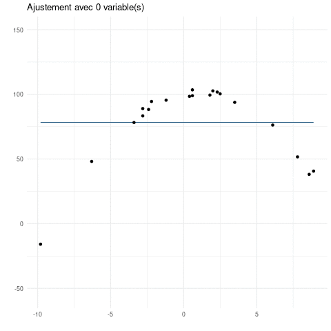

name: intro

<!-- F1D763 -->
<!-- F7A913 -->
<!-- C94326 -->
<!-- 1F908E -->
<!-- 33658A -->


```{r setup, include = FALSE,  eval = TRUE}
library('RefManageR')
source("../courses_tools/resources/knitr_setup.R")

common_img_dir <- file.path(main_dir,'courses_tools','resources', 'common_figs')
course_img_dir <- file.path(main_dir,'resources', 'figs')
BibOptions(check.entries = FALSE,
           bib.style = "authoryear",
           cite.style = "authoryear",
           style = "markdown",
           hyperlink = TRUE,
           max.names = 3,
           longnamesfirst= FALSE, 
           dashed = TRUE)
#myBib <- ReadBib('biblio_soutenance.bib', check = FALSE)
```

```{r xaringan-fit-screen, echo=FALSE}
xaringanExtra::use_fit_screen()
```


# Introduction

--
## Etude de la pollution au SO2

On a mesuré pour 41 villes américaines, la pollution au SO2 ainsi que la population dans la ville

```{r datapackage, eval = TRUE, echo = FALSE, warning = FALSE}
ggplot <- function(...) ggplot2::ggplot(...) + scale_fill_manual(values = wesanderson::wes_palette(name = "Darjeeling1")) + scale_color_manual(values = wesanderson::wes_palette(name = "Darjeeling1")) 
#remotes::install_github('MarieEtienne/coursesdata', force = TRUE)
```

```{r usdata_load, eval = TRUE, echo = c(1,2), warning = FALSE}
library(coursesdata) #remotes::install_github('MarieEtienne/coursesdata')
data(usdata)
```


```{r visu_reg_simple, eval = TRUE, echo = FALSE}
usdata %>% ggplot() +  aes(x= pop, y = SO2)+  geom_point()

```


--
<p class="question"> La taille d'une ville est elle liée à la pollution en SO2 ?</p>


---
template: intro
## Cadre général du modèle de régression simple

On étudie le lien entre  
- une variable quantitative notée $Y$ (l'indicateur de SO2),
- et une variable quantitative $x$ (la taille de la population)

Les données peuvent être visualisées à l'aide d'un nuage de points.

--
```{r visu_reg_simple, eval = TRUE}
```

--
<p class="question"> La variable x permet-elle d'expliquer la variabilité de la variable Y ?</p>

---
name: model
# Rappel : la régression simple

--


##  Une visualisation graphique du modèle d'analyse de régression simple

 .center[Si la population et la pollution en SO2 sont liées, comment imagine-t-on le processus aléatoire qui a conduit à nos données ?]

---

```{r reg_versiongraphique_prep, eval = TRUE, echo = FALSE}
set.seed(222)
n <- 20
x <- round(rnorm(n, mean= 10, sd = 2),2)
beta0 <- 1
beta1 <- 0.5
sigma <- 1
fake_dta <- tibble(x= x, y = rnorm(n, mean = beta0 + beta1*x, sd =sigma))  

x0 <-  x[9]
y0 <- fake_dta$y[9]
norm_dta <- tibble::tibble(y = rnorm(1000, mean=beta0 + beta1*x0, sd= sigma), x= x0 + dnorm(x = y- beta0 - beta1*x0, mean= 0,  sd=0.5))

norm_dta0 <- tibble::tibble(y = rnorm(1000, mean=mean(fake_dta$y), sd= sigma), x= x0 + dnorm(x = y - mean(fake_dta$y), mean= 0,  sd=0.5))
```


```{r reg_versiongraphique}
ggplot(data=fake_dta) + 
  xlim(range(fake_dta$x)) +ylim(range(fake_dta$y)) +
  ggtitle('Modèle Mcomp') +
  labs(x = 'Population', y = 'SO2') +
  theme(axis.text=element_blank(),
        axis.ticks=element_blank(),
        ) +
  geom_abline(slope = beta1, intercept = beta0) + #BREAK
  geom_point(x=x0, y=beta0+beta1*x0, col = 'red', size=2) + #BREAK
  geom_point(data=norm_dta, aes(y=y, x=x), col = 'red', alpha=0.02) + #BREAK
  geom_point(aes(x=x, y=y)) 
```

`r chunk_reveal("reg_versiongraphique", break_type = "user", display_type="output")`

---
template: model

.pull-left[
## Le modèle de régression simple, graphiquement

```{r reg_versiongraphique, eval = TRUE}
```
]

.pull-right[

## Le modèle de régression simple, mathématiquement 

$$M_{comp}:  \quad Y_{k} = \beta_0 +\beta_1 x_{k}  +E_{k},\quad E_{k}\overset{ind}{\sim}\mathcal{N}(0, \sigma^2),$$
avec 
- $x_k$ la valeur de la variable explicative pour l'observation $k$, 
- $k=1,\ldots,n$ le numéro d'individu, $n$ le nombre total d'individus,
- $\beta_0$ l'ordonnée à l'origine, 
- $\beta_1$ la pente de la droite, mesure de l'effet de la variable $x$

- $\sigma^2$ la variance.

### Nombre de paramètres du modèle

- $2$ paramètres de moyenne  $(\beta_0, \beta_1)$; 
- 1 paramètre de variance $\sigma^2$

]

---
template: model

##  Une visualisation graphique du modèle d'analyse de régression simple

 .center[Si la population et la pollution en SO2 n'ont aucun lien , comment imagine-t-on le processus aléatoire qui a conduit à nos données ?]


---
```{r reg_versiongraphique_M0}
ggplot(data=fake_dta) + 
  xlim(range(fake_dta$x)) +ylim(range(fake_dta$y)) +
  labs(x = 'Population', y = 'SO2') +
  theme(axis.text=element_blank(),
        axis.ticks=element_blank(),
        ) +
  ggtitle('Modèle nul') +
  geom_abline(slope = 0, intercept = mean(fake_dta$y)) + #BREAK
  geom_point(x=x0, y = mean(fake_dta$y), col = 'red', size=2) + #BREAK
  geom_point(data=norm_dta0, aes(y=y, x=x), col = 'red', alpha=0.02) + #BREAK
  geom_point(aes(x=x, y=y)) +
  labs(x = 'Population', y = 'SO2')

```


`r chunk_reveal("reg_versiongraphique_M0", break_type = "user", display_type="output")`


---
template: model

.pull-left[
## Le modèle sans effet de la variable population, graphiquement

```{r reg_versiongraphique_M0, eval = TRUE}
```
]

.pull-right[

## Le modèle sans effet de la variable population, mathématiquement

$$M_0: \quad Y_{k} = \beta_0  + E_{k},\quad E_{k}\overset{ind}{\sim}\mathcal{N}(0, \sigma^2),$$
avec 
- $k=1,\ldots,n$ le numéro d'individu, $n$ le nombre total d'individus,
- $\beta_0$ l'ordonnée à l'origine, 

- $\sigma^2$ la variance.

### Nombre de paramètres du modèle

- $1$ paramètres de moyenne  $(\beta_0, \beta_1)$; 
- 1 paramètre de variance $\sigma^2$

]


```{r anova_versiongraphique_save, eval = TRUE}
pM0 <- ggplot(data=fake_dta) + 
  ylab('y') + xlim(range(fake_dta$x)) +ylim(range(fake_dta$y)) +
  ggtitle('Modèle nul') +
  geom_abline(slope = 0, intercept = mean(fake_dta$y)) + #BREAK
  geom_point(x=x0, y = mean(fake_dta$y), col = 'red', size=2) + #BREAK
  geom_point(data=norm_dta0, aes(y=y, x=x), col = 'red', alpha=0.02) + #BREAK
  geom_point(aes(x=x, y=y)) 
pMcomp <- ggplot(data=fake_dta) + 
  ylab('y') + xlim(range(fake_dta$x)) +ylim(range(fake_dta$y)) +
  ggtitle('Modèle Mcomp') +
  geom_abline(slope = beta1, intercept = beta0) + #BREAK
  geom_point(x=x0, y=beta0+beta1*x0, col = 'red', size=2) + #BREAK
  geom_point(data=norm_dta, aes(y=y, x=x), col = 'red', alpha=0.02) + #BREAK
  geom_point(aes(x=x, y=y)) 
```


---
template: model

.center[Lequel de ces mécanismes est le plus crédible au vu des données ?]

```{r compare_model_graph, eval = TRUE, echo = FALSE}
ggpubr::ggarrange(pMcomp, pM0, nrow = 1, common.legend = TRUE)
```
--

Les statistiques permettent de comparer ces deux modèles pour répondre à cette question.


---
template: model

## Le modèle de régression simple sur l'exemple de la pollution.

$$Y_{k} = \beta_0 +\beta_1 x_{k}  +E_{k},\quad E_{k}\overset{ind}{\sim}\mathcal{N}(0, \sigma^2),$$
avec 
- $x_k$ la population dans la ville $k$, 
- $k=1,\ldots,n$ le numéro de la ville, $n=41$,
- $\beta_0$ l'ordonnée à l'origine, 
- $\beta_1$ la pente de la droite, mesure de l'effet de la population sur la pollution.

- $\sigma^2$ la variance.

### Nombre de paramètres du modèle
- 2 paramètres de moyennes
- 1 paramètre de variance


---
template: model

## L'écriture générique du modèle linéaire

$$\bf{Y}=\begin{pmatrix}
Y_{1}\\
Y_{2}\\
\vdots\\
Y_{k}\\
\vdots\\
Y_{n}\end{pmatrix} 
 = \begin{pmatrix} 
\beta_0 + \beta_1\,x_1\\
\beta_0 + \beta_1\,x_2\\
\vdots \\
\beta_0 + \beta_1\,x_k\\
 \vdots \\
\beta_0 + \beta_1\,x_n\\
 \end{pmatrix}+ \overset{}{\begin{pmatrix}
E_{1}\\
E_{2}\\
\vdots\\
E_{k}\\
\vdots\\
E_{n}\\
\end{pmatrix}}$$

--
$${\bf{X}} =\overset{\color{gray}{\begin{matrix}\beta_0  & \beta_1\end{matrix}}}{\begin{pmatrix}
1 & x_1\\
1 & x_2\\
\vdots & \vdots\\
1 & x_k\\
 \vdots & \vdots\\
1 & x_n\\
 \end{pmatrix}},\quad
{\bf{\theta}} =\begin{pmatrix}
\beta_0\\
\beta_1\\
\end{pmatrix}, \quad{\bf{E}} = \overset{}{\begin{pmatrix}
E_{1}\\
E_{2}\\
\vdots\\
E_{k}\\
\vdots\\
E_{n}\\
\end{pmatrix}}$$

--
 
 
 $$\class{rouge}{ \bf{Y = X\theta + E}}$$
 

---
template: model

## Exercice

Les données de pollution
.pull-left[

```{r pol_data, eval = TRUE}
usdata %>% select(City, pop, SO2) %>% as_tibble() %>% print(n=4)
```


<p class=question> Détailler le modèle sous forme matricielle pour l'exemple de la pollution (écrire les 3 premières lignes de la matrice $X$ )</p>
]

--

.pull-right[
## Correction 


```{r m_comp_false, eval = TRUE, echo = FALSE, out.width="100%"}
Mpop <- lm(SO2 ~ pop , data = usdata)
model.matrix(Mpop) %>% head(n = 3)
```

]


---
name: reg_multiple
# Le modèle de régression multiple

--

## Présentation du problème
.pull-left[
Plusieurs variables sont potentiellement liées à la pollution en SO2


- temp : Average temperature in Fahrenheit
- manuf : No. of companies employing more than 20 employees
- pop : Population in thousands
- wind : Average annual wind speed in miles/hour
- precip : annual precipitation height in inches
- days : No. of days of precipitation

]

--

.pull-right[

```{r show_data, eval = TRUE}
usdata %>% as_tibble() %>% print(n=5)
```

]

--
.center[
<a class=question> Quelles sont les variables liées à la pollution en SO2 ? </a>
]


---
template: reg_multiple

## Le modèle de régression multiple 

$$Y_{k} = \beta_0 +\beta_1 x_{k,1}  + \beta_2 x_{k,2} + \ldots +  \beta_p x_{k,p}  +  E_{k},\quad E_{k}\overset{ind}{\sim}\mathcal{N}(0, \sigma^2),$$
avec 
- $x_{k,l}$ la valeur de la variable explicative $l$ pour l'observation $k$, 
- $k=1,\ldots,n$ le numéro d'individu, $n$ le nombre total d'individus,
- $\beta_0$ l'ordonnée à l'origine, 
- $\beta_l$ l'effet de la variable $x{,l}$ sur la variable à expliquer,
- $\sigma^2$ la variance.

--

### Nombre de paramètres du modèle

- $p+1$ paramètres de moyenne  $(\beta_0, \beta_1, \ldots, \beta_p)$; 
- 1 paramètre de variance $\sigma^2$

---
template: model
## Sous forme matricielle
 $$\bf{Y = X\theta + E}$$

$$Y=\begin{pmatrix}
Y_{1}\\
Y_{2}\\
\vdots\\
Y_{k}\\
\vdots\\
Y_{n}\end{pmatrix},
 \quad
{\bf{X}} =\overset{\color{gray}{\begin{matrix}\beta_0  && \beta_1&& \beta_2&&\ldots &&\beta_p\end{matrix}}}{\begin{pmatrix}
1 & x_1^{1} & x_1^{2} & \ldots &x_1^{l}\\
1 & x_2^{1} & x_2^{2} & \ldots &x_2^{l}\\
\vdots & \vdots& \vdots && \vdots\\
1 & x_k^{1} & x_k^{2} & \ldots &x_k^{l}\\
 \vdots & \vdots& \vdots && \vdots\\
1 & x_n^{1} & x_n^{2} & \ldots &x_n^{l}\\
 \end{pmatrix}},\quad
{\bf{\theta}} =\begin{pmatrix}
\beta_0\\
\beta_1\\
\beta_2\\
\vdots\\
\beta_p\\
\end{pmatrix}, \quad{\bf{E}} = \overset{}{\begin{pmatrix}
E_{1}\\
E_{2}\\
\vdots\\
E_{k}\\
\vdots\\
E_{n}\\
\end{pmatrix}}$$


--

.care[BREAKING NEWS !!!
]

.center[
.rouge[


Tous les modèles vus en cours depuis le début peuvent s'écrire sous la forme 
$$ Y = X\theta +E $$ 
Ce sont tous des modèle slinéaires (d'où la commande `lm` ).
]
]

---
name: parametre
# Estimation des paramètres d'un modèle linéaire.


---
template: parametre
## Estimation des paramètres du modèle version matricielle

Le modèle sous forme matricielle s'écrit

$$\bf{Y = X\theta + E}.$$
avec  $\class{rouge}{\theta}$ .rouge[inconnu]  qu'on cherche à estimer.

--

## Propriété mathématique

$$\mathbb{E}(\bf{Y}) = \bf{X\theta}$$ 
Il s'agit donc de résoudre un système.

--

$$\bf{X^\intercal}\mathbb{E}(\bf{Y}) = \bf{X^\intercal}\bf{X\theta}$$ 
--

Si $\bf{X^\intercal}\bf{X}$ est inversible  alors

$$\bf{\theta} = (X^\intercal X )^{-1} X^\intercal \mathbb{E}(Y) .$$

--
On remplace $\mathbb{E}(\bf{Y})$ par notre meilleure approximation et 
--
.care[ TADAAA !!!!]


---

template: parametre
###  Estimateur de $\theta$ : $T$

$$T = \begin{pmatrix} B_0 \\ B_1 \\ \vdots \\ B_p \end{pmatrix} = (X^\intercal X )^{-1} X^\intercal Y$$

$B_i$ représente un estimateur de $\beta_i$.

--

### Loi de l'estimateur de $\theta$


$$T  \sim \mathcal{N}_{p+1}\left(\theta, \sigma^2 (X^\intercal X )^{-1}\right).$$

---
template: parametre
## Le paramètre de variance

L'estimateur de la somme des carrés résiduels s'écrit sous la forme 

$$RSS = || Y- X \, T ||^2 = \sum_{k=1}^{n} (Y_k - B_0 + B_1 x_1 + \ldots + B_p x_p)^2$$

### Estimateur de la variance 

  $$S^2 =\frac{1}{DF_{res}} RSS, $$
est un <a class=care> estimateur sans bias de  $\sigma^2$ </a> .

Dans le cas du modèle de régression simple  $DF_{res}=n-(p+1)$ (n observations et p+1 paramètres de moyennes à estimer, le nombre de composantes dans le vecteur $\theta$)

--

## Estimation de $\sigma^2$

$$\hat{\sigma}^2 =\frac{1}{n-(p+1)} RSS_{obs},$$
$$RSS_{obs} = || Y- X \, \hat{\theta} ||^2 = \sum_{k=1}^{n} (Y_k - \hat{\beta}_0 + \hat{\beta}_1 x_1 + \ldots + \hat{\beta}_p x_p)^2$$


---
template: parametre
## Vérifier l'estimation sur l'exemple de la pollution

.pull-left[

### Estimation manuelle des paramètres de moyenne

```{r estimation_mult, eval = TRUE, echo = TRUE}
Mcomp <- lm(SO2 ~ pop + temp + manuf + wind + precip + days, data = usdata)
X <- model.matrix(Mcomp)
XXprimemoinsUn <- solve(t(X)%*%X)
XXprimemoinsUn %*% t(X) %*% matrix(usdata$SO2, ncol =1)
```

```{r loi_estim,  eval = TRUE, echo = TRUE}
sqrt( diag( summary(Mpop)$sigma^2 * XXprimemoinsUn ) )
```
] 

--

.pull-right[
### En demandant à R

```{r summary_Mcomp, eval = TRUE, echo = TRUE}
summary(Mcomp)$coefficients
```

]


---
name: modcomp
# Test du modèle complet

--

## Pollution 

<p class="question"> La pollution en SO2 dans les villes américaines est elles liées à l'une au moins des variables caractérisiques des villes ?</p>


--

On va à la pêche ....

---
template: modcomp
## Sous forme de comparaison de modèle


```{r compare_model_graph2, ref.label='compare_model_graph', eval = TRUE, echo = FALSE, results='markup'}
```

Sauf que le modèle complet est bien plus complet ....

--
<p class="question"> Le modèle Mcomp est il plus pertinent que le modèle M0 ?</p>


---
template: modcomp
## Hypothèses du test

On va donc opposer une hypothèse de travail $H_0$ contre une hypothèse alternative $H_1$. $H_0$ peut donc prendre différentes formes:


$$\begin{align} 
H_0 & =\left \lbrace \mbox{Auncune variable n'est liée à la pollution en SO2}\right\rbrace\\
    & =\left \lbrace  \mbox{pour tout }l\geq 1, \beta_l =0   \right\rbrace\\
    & =\left \lbrace  M_{comp} \mbox{ est équivalent à } M0 \right\rbrace.
\end{align}$$


$H_1$ prend les formes équivalentes suivantes

$$\begin{align} 
H_1 & =\left \lbrace \mbox{Au moins 1 variable est liée à la pollution en SO2}\right\rbrace\\
    & =\left \lbrace  \mbox{Il existe un } l, \beta_l \ne 0  \right\rbrace\\
    & =\left \lbrace  M_{comp} \mbox{ est préférable à } M0 \right\rbrace.
\end{align}$$

--

Sous $H_0$, 

$$F= \frac{ \frac{RSS_0 - RSS}{p} }{\frac{RSS}{n-(p+1)}}  \underset{H_0}{\sim}\mathcal{F}(p, n-(p+1))$$  

---
template: modcomp
## Loi de la statistique de test sous $H_0$ - graphiquement

Sous $H_0$ la loi de distribution de $F$ est 

```{r p_value, eval = TRUE}
tibble(x = seq(0, 10, length.out = 2001)) %>% 
  mutate(y = df(x, df1 = 4, df= 38)) -> chi_dta
Fobs <- 1
chi_dta %>% filter(x> Fobs) %>% add_row(x=100,y = 0) %>%  add_row(x=Fobs, y =0)  %>% 
  add_row(x=Fobs, y =df(Fobs, df1 = 4, df= 38)) %>% arrange(x,y)  -> chi_dta_poly
```


```{r pvalue_graphique}
ggplot(data  = chi_dta) + xlab('y') + ylab('density') + geom_line(aes(x=x, y=y)) + #BREAK
  annotate("text", x = Fobs- 0.5, y = 0.05, label = "Fobs", col = 'red')+  geom_vline(aes(xintercept = Fobs), col = 'red') + #BREAK
  geom_polygon(data = chi_dta_poly,  aes(x=x, y= y), alpha = 0.3) + xlim(c(0, max(chi_dta$x))) 

```

---

`r chunk_reveal("pvalue_graphique", break_type = "user", display_type="output")`

---
name: test_variable
# Test de l'effet des variables

---
template: test_variable

## Test sur les paramètres

Tester la nullité du paramètre $\beta_l$ revient à tester si la variable $x^{l}$ et la variable $Y$ sont liées.


--

Ce test est similaire  au test de comparaison entre le modèle complet et le modèle complet privé de la variable $x^{l}$.


$$\begin{align} 
H_0 & =\left \lbrace \mbox{Dans le modèle complet la variable } l \mbox{ n'a pas d'influence}\right\rbrace\\
    & =\left \lbrace  \mbox{Dans le modèle complet la variable } \beta_l \mbox{ n'a pas d'influence}\right\rbrace\\
    & =\left \lbrace  M_{comp} \mbox{ est équivalent à } M_{-l} \right\rbrace,
\end{align}$$

avec 
$$M_{-l}: Y_k = \beta_0 + \beta_1 x_{k,1} + \ldots + \beta_{l-1} x_{k,l-1} + \beta_{l+1} x_{k,l+1} + \ldots + \beta_{p} x_{k,p} + E_{k}$$

---
count: false
template: test_variable

## Equivalence des tests sur l'exemple de la pollution : efft de la population
.pull-left[

```{r car, echo=FALSE, eval=TRUE}
library(car)
```

```{r pol_mult, eval = TRUE, echo = TRUE}
summary(Mcomp)$coefficients
```
]
--
.pull-right[
### Lien entre les statistiques  de tests

```{r stu2, eval = TRUE, echo =TRUE}
Mcomp_l <- lm(SO2 ~  temp + manuf +  wind + precip + days, data = usdata) 
anova(Mcomp_l, Mcomp)
```
]
---
template: test_variable
## Vigilance sur l'interprétation des tests et des estimations


```{r test_inter, eval =TRUE}
summary(Mcomp)$coefficients
```

--
```{r ggpairs, eval = TRUE}
GGally::ggpairs(usdata, columns = 2:8)
```


---
name: ajust
# Ajustement et choix de modèles


```{r surajust_simulation, eval = TRUE, echo = FALSE}
set.seed(123)
beta0 <- 100
beta1 <- 2
beta2 <- 1

n <- 20
imax <-9
x <- round(rnorm(n, mean=0, sd = 5),1)
y <- rnorm(n, mean= beta0+beta1*x - beta2 * x^2, sd = 3)
dta <- tibble(x1=x, y=y, x2 =x^2, x3 = x^3, x4 = x^4 , x5 =x^5, x6 =x^6, x7= x^7, x8 = x^8, x9 =x^9, x10= x^10, x11 = x^{11} ) 

new_dta <- tibble(x=seq(min(x), max(x), length.out=1000),x1=x,  x2=x^2, x3 =x^3, x4 =x^4, x5 = x^5, x6 =x^6, x7= x^7, x8 = x^8, x9 =x^9, x10= x^10, x11 = x^{11} ) 

surajust_list <- lapply(1:imax, function(i){
  if(i==1)
    f1 <-  as.formula('y ~1')
  else
    f1 <-  as.formula(paste0('y ~  ',paste0( paste0('x', 1:(i-1), collapse = ' + '))))
  M <- lm(f1, data=dta)
  p <- new_dta%>% 
  mutate(y=as.numeric(predict(M, newdata=new_dta)))%>% 
  ggplot() +geom_line(aes(x=x, y=y), col =  "#33658A")+ geom_point(data=dta, aes(x=x, y=y))+
  ylim(c(-55,150)) + labs(x='', y='') +ggtitle(paste0('Ajustement avec ', i-1, ' variable(s)'))
  R2 <- summary(M)$r.squared
  return(list(p=p, R2=R2, AIC = BIC(M), Model=paste0('M',i-1)))
})
```


## Un critère pour mesurer l'ajustement du modèle

--

### Le coefficient de détermination $R^2$ pour un modèle

$$R^2(M)=\frac{RSS_0-RSS_M}{RSS_0}= 1 -\frac{RSS_M}{RSS_0}$$

--
### Les limites de $R^2$ pour la sélection

.pull-left[
```{r R2_table, echo = FALSE, eval = TRUE}
tibble(Model = paste0('M', (1:imax)-1), R2= unlist(lapply(surajust_list, function(l){l$R2}))) %>% 
  kableExtra::kable(digits=4, format = "html", escape = FALSE) 
  
```
]

--

 .pull-right[
```{r ajust_git, eval = TRUE, message = FALSE}
  gif <-function(){ 
      lapply(surajust_list, function(i) {
        print(i$p)
      })
    }
    library(animation)
     ok <- saveGIF(gif(), interval = 1, movie.name="Ajustement.gif")
```
 
  
 
 ]

---
template: ajust


### Le coefficient de détermination $R^2$

$$R^2(M)=\frac{RSS_0-RSS_M}{RSS_0}= 1 -\frac{RSS_M}{RSS_0}$$

### Le critère Akaike (AIC)

Il utilise la vraisemblance (une fonction qui mesure justement l'ajustement du modèle aux données) et lui ajoute une pénalité pour compenser le nombre de paramètre et éviter le surajustement.

Il est défini de manière générale pour les modèles statistiques mais dans le cas du modèle linéaire, il est donné par 


$$ AIC(M) = p +  n \class{orange}{\ln{\frac{RSS}{n-(p+1))}}} + n + 3 + n\ln{2\pi} $$

$$ AIC(M) = p +  n \class{orange}{\ln{\hat{\sigma}_M}}  \class{clair}{ + n + 3 + n\ln{2\pi}} $$
.care[On va préférer le modèle avec l'AIC le plus petit]


---

name: ajust
# Ajustement et choix de modèles

## Comparaison AIC et $R^2$

-
.pull-left[
```{r R2_AIC_table, echo = FALSE, eval = TRUE}
tibble(Model = paste0('M', (1:imax)-1), R2= unlist(lapply(surajust_list, function(l){l$R2})),
       AIC = unlist(lapply(surajust_list, function(l){l$AIC}))) %>% 
  kableExtra::kable(digits=4, format = "html", escape = FALSE) 
  
```
]


 .pull-right[

  
 
 ]


Utilisé en TD pour choisir un modèle avec un bon compromis ajustement et parcimonie (petit nombre de paramètres).

---

name: prediction
# Prediction

--

Il est fréquent d'utiliser un modèle de régression pour prédire. 

## Cas de la régression simple

### Prédiction de la valeur moyenne pour un $x$ particulier

* Valeur moyenne .rouge[attendue] pour $y$ pour un $x$ donné : $\class{rouge}{\beta_0} + \class{rouge}{\beta_1} x.$

* Valeur moyenne .orange[prédite] pour $y$ pour un $x$ donné : $\class{orange}{\hat{\beta}_0} + \class{orange}{\hat{\beta}_1 x.}$

```{r pred, eval = TRUE, echo = TRUE}
predict(Mpop, newdata=data.frame(pop=333))
```

--

### Intervalle de confiance pour la valeur moyenne prédite  pour $y$ pour un $x$ donné : 
$B_0+B_1 x \sim\mathcal{N}(\beta_0 + \beta_1 x, \sigma^2 \class{clair}{Constante} )$

```{r pred_IC, eval = TRUE, echo = TRUE}
predict(Mpop, newdata=data.frame(pop=333), interval = 'confidence')
```

---
template:  prediction
Il est fréquent d'utiliser un modèle de régression pour prédire. 

## Cas de la régression simple

### Prédiction de la valeur moyenne pour un $x$ particulier et son intervalle de confiance

```{r conf_plot, eval = TRUE}
ic <- predict(Mpop, newdata=data.frame(pop=333), interval = 'confidence')
p1 <- ggplot(usdata) + aes(x=pop, y= SO2 ) + geom_point() + geom_smooth(method= 'lm', se = TRUE, col = "#33658A") +
  geom_point(data=data.frame(pop=333, SO2 = predict(Mpop, newdata=data.frame(pop=333))),
             aes(x=pop, y = SO2), col = "#F7A913", size = 3) +
  geom_segment(aes(x=333, xend=333, y = ic[2], yend=ic[3]), col = "#F7A913", size=1.5)
print(p1)
```


---
template:  prediction
Il est fréquent d'utiliser un modèle de régression pour prédire. 

## Cas de la régression simple

### Prédiction d'une .vert[nouvelle valeur] $\class{vert}{Y_{new}}$ pour un $x$ donné

*  $\mathbb{E}(Y_{new}) = \beta_0 + \beta_1 x$

* La variance de $Y_{new}$ prend en compte l'incertitude sur les paramètres et la variabilité naturelle des observations ( $\sigma^2$ )

```{r pred_x, eval = TRUE, echo = TRUE}
predict(Mpop, newdata=data.frame(pop=333), interval = 'prediction')
```


---
template:  prediction
Il est fréquent d'utiliser un modèle de régression pour prédire. 

## Cas de la régression simple

### Prédiction d'une .vert[nouvelle valeur] $\class{vert}{Y_{new}}$ pour un $x$ donné

```{r predic_plot_pred, eval = TRUE}
pred_interval <- predict(Mpop,  interval="prediction", level = 0.95)
pred_interval <- as.data.frame(pred_interval) %>% mutate(pop=usdata$pop) %>% arrange(pop)


pred_interval <- predict(Mpop,  interval="prediction", level = 0.95) 
pred_interval <- as.data.frame(pred_interval) %>% mutate(pop=usdata$pop) %>% arrange(pop)

ic_pred <- predict(Mpop,  newdata=data.frame(pop = 333), interval="prediction", level = 0.95) 
ggplot(usdata) + geom_point(aes(x=pop, y= SO2 ) )  + 
  geom_ribbon(data=as.data.frame(pred_interval), aes(x = pop, ymin = lwr, ymax = upr), fill = "#1F908E", alpha = 0.1) + geom_smooth(method= 'lm', se = TRUE, aes(x=pop, y= SO2 ), col = "#33658A" ) +
  geom_segment(aes(x=333, xend=333, y = ic_pred[2], yend=ic_pred[3]), col = "#1F908E", size=1.2) +
  geom_segment(aes(x=333, xend=333, y = ic[2], yend=ic[3]), col = "#F7A913", size=1.2) 
  
```


---
template:  prediction
Il est fréquent d'utiliser un modèle de régression pour prédire. 

## Cas de la régression multiple

### Prédiction de la valeur moyenne pour des variables explicatives  $(x_1, \ldots, x_p)$ particulières

--

$$\hat{Y}_k = \hat{\beta_0} +\hat{\beta_1} x_{k,1}+ \ldots + \hat{\beta_p} x_{k,p}$$


--

### Intervalle de confiance pour la valeur moyenne préditepour des variables explicatives  $(x_1, \ldots, x_p)$ particulières :
$$B_0+B_1 x_1 + \ldots + B_p x_p \sim\mathcal{N}(\beta_0 + \beta_1 x_1 +\ldots +\beta_p x_p, \sigma^2 \class{clair}{Constante} )$$


--

Plus généralement, on connaît la loi de n'importe quelle combinaison linéaire des paramères

$$c T \sim\mathcal{N}(c\theta , \sigma^2 \class{clair}{Constante_c} )$$


---
# Ce qu'il faut absolument savoir pour les TDs

- savoir reconnaître une situtation de régression multiple
--

  * On cherche à comprendre le lien entre une variable d'intérêt $Y$ et des variables potentiellement explicatives toutes quantitatives.
  
--
- savoir écrire le modèle de régression multiple

--
- Tester l'existence de l'effet d'au moins une des variables explicatives candidates

--
- Tester l'existence de l'effet d'une variable explicative particulière

--
- Pourquoi il faut se méfier du $R^2$

--
- Ce que signifie prédire en tuilisant le modèle et comment le faire


```{r ggplot_back, echo = FALSE, eval = TRUE}
ggplot <- function(...) ggplot2::ggplot(...) 
```

